# Pharmacy Management System — Entity Relationship Design

**Status:** Proposed Phase 1 logical and physical schema derived strictly from `docs/BRD.md`

**Scope:** Documentation only. This file does not authorize creating Django models or migrations.

## 1. Source, precedence, and design decisions

`docs/BRD.md` is the sole requirements source for this ERD. If this document accidentally conflicts with the BRD, the BRD wins and this ERD must be corrected before implementation.

### 1.1 Identifier strategy

All new project-owned entities use a PostgreSQL `uuid` primary key represented in Django as:

```python
id = models.UUIDField(primary_key=True, default=uuid.uuid4, editable=False)
```

Rationale:

- the BRD calls for UUID business identifiers where compatible;
- the repository has no project-owned business models or migration convention to preserve;
- one consistent identifier type simplifies cross-app references, offline document references, audit references, and idempotency targets;
- UUIDs avoid exposing predictable business-row counts.

The existing Django framework tables are the only exception. `auth_user`, `auth_group`, permissions, sessions, and admin tables retain their Django-provided auto-increment identifiers. The project must not replace Django's built-in User model to force UUIDs.

### 1.2 Numeric conventions

| Concept | Django/PostgreSQL representation | Rule |
|---|---|---|
| Quantities in a selected/base unit | `DecimalField(max_digits=14, decimal_places=3)` / `numeric(14,3)` | Never float; zero/non-zero rules are entity-specific. |
| Unit conversion factor | `DecimalField(max_digits=14, decimal_places=6)` / `numeric(14,6)` | Greater than zero; the base unit equals `1.000000`. |
| Unit price or acquisition cost | `DecimalField(max_digits=14, decimal_places=4)` / `numeric(14,4)` | Never float; non-negative. |
| Posted money totals and payments | `DecimalField(max_digits=14, decimal_places=2)` / `numeric(14,2)` | Never float; normally non-negative. |
| Tax percentage | `DecimalField(max_digits=7, decimal_places=4)` / `numeric(7,4)` | Range `0.0000` through `100.0000`. |

### 1.3 Timestamp convention

- Mutable entities include `created_at = DateTimeField(auto_now_add=True)` and `updated_at = DateTimeField(auto_now=True)`.
- Append-only entities such as stock movements and audit events include `created_at`/`occurred_at` but no `updated_at`.
- Posted transactional headers also include `posted_at`; reversible records include reversal fields rather than rewriting the original values.
- Django stores aware timestamps in UTC. The pharmacy-local timezone needed for FEFO date comparison is an open question in Section 13.
- In compact entity definitions below, the shorthand `created_at; updated_at` means those exact two `DateTimeField` declarations; it does not imply unspecified types.

### 1.4 Deletion convention

- Master/reference data uses logical deactivation through `is_active`; it is not hard-deleted after being referenced.
- Unposted drafts may be hard-deleted only when no posted record, stock movement, payment, audit event, or other protected dependency references them.
- Posted financial, inventory, payment, shift, return/refund, discrepancy, document-sequence, idempotency, and audit records are never hard-deleted through application workflows. They use status, reversal, void, or resolution records.
- Stock movements and audit events are append-only. A correction creates a compensating record.

### 1.5 Foreign-key convention

- Every project-owned FK to another project entity uses PostgreSQL `uuid` and a Django `ForeignKey`/`OneToOneField`.
- FKs to Django User or Group use the existing framework PK type (`bigint` in the current default schema) and must be declared through `settings.AUTH_USER_MODEL` or Django's Group model.
- All FKs receive their normal database index. Each entity below also lists explicit composite/search indexes.
- `PROTECT` is used when deletion would destroy transaction history; `SET_NULL` is used only where the historical snapshot remains sufficient and the actor/reference may legitimately disappear from active use.

## 2. App ownership and reserved navigation namespaces

| Owning app | Tables owned | Reserved navigation namespace(s) |
|---|---|---|
| `apps.accounts` | No project user/role table; integrates Django auth tables | `accounts` |
| `apps.core` | Pharmacy settings, tax rates, payment methods, document sequences, idempotency, audit | `settings` |
| `apps.dashboard` | No persistent Phase 1 business entity required | `dashboard` |
| `apps.catalog` | Categories, manufacturers, medicines, units, barcodes, price history | `medicines` |
| `apps.parties` | Suppliers, customers, prescribers | `suppliers`, `customers` |
| `apps.inventory` | Batches, stock operations/movements, counts, adjustments, discrepancies, alerts | `inventory` |
| `apps.purchasing` | Purchase orders, receipts, purchase invoices | `purchases` |
| `apps.sales` | Draft/held/completed sales invoices and lines | `sales` |
| `apps.prescriptions` | Prescriptions and prescription items | `prescriptions` |
| `apps.finance` | Customer/supplier payments and pharmacist shifts; read-only invoice hub | `payments`, `invoices` |
| `apps.returns` | Customer returns/refunds and supplier returns | `returns` |
| `apps.reports` | No report transaction tables; query/export services only | `reports` |

The `invoices` namespace is an aggregate view over `sales_sales_invoice` and `purchasing_purchase_invoice`; it does not own a duplicate invoice table.

## 3. Relationship overview

```mermaid
erDiagram
    AUTH_USER ||--o{ SALES_INVOICE : completes
    AUTH_USER ||--o{ CASHIER_SHIFT : opens
    AUTH_GROUP ||--o{ INVENTORY_ALERT : targets

    CATEGORY ||--o{ MEDICINE : classifies
    MANUFACTURER ||--o{ MEDICINE : makes
    MEDICINE ||--o{ MEDICINE_UNIT : has
    MEDICINE_UNIT ||--o{ MEDICINE_BARCODE : identifies
    MEDICINE ||--o{ MEDICINE_BATCH : stocked_as

    SUPPLIER ||--o{ PURCHASE_ORDER : receives
    PURCHASE_ORDER ||--|{ PURCHASE_ORDER_ITEM : contains
    PURCHASE_ORDER ||--o{ PURCHASE_RECEIPT : fulfilled_by
    PURCHASE_RECEIPT ||--|{ PURCHASE_RECEIPT_LINE : contains
    SUPPLIER ||--o{ PURCHASE_INVOICE : bills
    PURCHASE_INVOICE ||--|{ PURCHASE_INVOICE_LINE : contains
    PURCHASE_INVOICE ||--o{ SUPPLIER_PAYMENT : settled_by

    CUSTOMER o|--o{ SALES_INVOICE : billed_to
    PRESCRIPTION o|--o{ SALES_INVOICE : supports
    SALES_INVOICE ||--|{ SALES_INVOICE_LINE : contains
    SALES_INVOICE ||--o{ CUSTOMER_PAYMENT : settled_by

    STOCK_OPERATION ||--|{ STOCK_MOVEMENT : groups
    MEDICINE_BATCH o|--o{ STOCK_MOVEMENT : affected_by
    SALES_INVOICE o|--o| STOCK_OPERATION : posts
    PURCHASE_RECEIPT o|--o| STOCK_OPERATION : posts
    CUSTOMER_RETURN o|--o| STOCK_OPERATION : may_restock
    SUPPLIER_RETURN o|--o| STOCK_OPERATION : posts
    STOCK_COUNT o|--o| STOCK_OPERATION : reconciles
    STOCK_ADJUSTMENT o|--o| STOCK_OPERATION : posts

    SALES_INVOICE ||--o{ CUSTOMER_RETURN : source_for
    CUSTOMER_RETURN ||--|{ CUSTOMER_RETURN_LINE : contains
    CUSTOMER_RETURN ||--o{ CUSTOMER_REFUND : refunded_by
    SUPPLIER ||--o{ SUPPLIER_RETURN : receives
    SUPPLIER_RETURN ||--|{ SUPPLIER_RETURN_LINE : contains
```



The authoritative inventory design is detailed in Section 7. A source document never performs independent stock arithmetic: it owns or references one posted `inventory_stock_operation`, whose `inventory_stock_movement` rows are the only batch-level quantity effects.

## 4. Existing framework identity entities

These are existing Django-owned entities, not new project models.

### 4.1 Django User

- **Table:** `auth_user`
- **Owner:** `django.contrib.auth`; integrated by `apps.accounts`
- **Navigation:** `accounts`

| Field | Exact type | Null/default | Notes |
|---|---|---|---|
| `id` | `BigAutoField` / `bigint` | PK | Existing auto-increment exception to the project UUID rule. |
| `password` | `CharField(128)` | required | Django password hash. |
| `last_login` | `DateTimeField` | NULL | Existing Django field. |
| `is_superuser` | `BooleanField` | `False` | Preserved, but not the Owner/Admin business-role mechanism. |
| `username` | `CharField(150)` | required | Unique; username/password login is fixed. |
| `first_name` | `CharField(150)` | blank | Existing Django field. |
| `last_name` | `CharField(150)` | blank | Existing Django field. |
| `email` | `EmailField(254)` | blank | Not used to replace username login. |
| `is_staff` | `BooleanField` | `False` | Django admin-site access flag. |
| `is_active` | `BooleanField` | `True` | Logical account activation. |
| `date_joined` | `DateTimeField` | Django default | Existing Django field. |

- **Relationships:** M:N with `auth_group`; M:N with `auth_permission` through Django-owned join tables.
- **Indexes/constraints:** PK; unique username; Django-provided indexes and join-table uniqueness.
- **Deletion policy:** deactivate with `is_active=False`; do not hard-delete a user referenced by business/audit records.

### 4.2 Django Group

- **Table:** `auth_group`
- **Owner:** `django.contrib.auth`; integrated by `apps.accounts`
- **Navigation:** `accounts`

| Field | Exact type | Null/default | Notes |
|---|---|---|---|
| `id` | `BigAutoField` / `bigint` | PK | Existing auto-increment framework identifier. |
| `name` | `CharField(150)` | required | Unique. Exact business values: `Owner / Admin`, `Pharmacist`, `Inventory Manager`, `Accountant`. |

- **Relationships:** M:N users; M:N permissions.
- **Indexes/constraints:** PK; unique group name; deterministic provisioning must give `Owner / Admin` all project permissions.
- **Deletion policy:** no hard deletion of the four required groups after use; permission/membership changes are audited.

## 5. Core entities (`apps.core`, navigation `settings`)

### 5.1 Pharmacy settings

- **Entity/table:** `PharmacySettings` / `core_pharmacy_settings`
- **Cardinality:** exactly one active row for the single pharmacy.

| Field | Exact Django type | Null/default | Purpose |
|---|---|---|---|
| `id` | `UUIDField` | PK, UUIDv4 | Project identifier. |
| `singleton_key` | `PositiveSmallIntegerField` | fixed `1`, unique, non-editable | Enforces one settings row. |
| `pharmacy_name` | `CharField(max_length=200)` | required | Printed identity. |
| `phone` | `CharField(max_length=32)` | blank | Contact. |
| `email` | `EmailField(max_length=254)` | blank | Contact. |
| `address` | `TextField` | blank | Printed address. |
| `currency_code` | `CharField(max_length=3)` | required | ISO-style currency code; exact supported values are an open question. |
| `default_tax_rate_id` | `ForeignKey(TaxRate, PROTECT)` | NULL/blank | Default applicable tax. |
| `expiry_warning_days` | `PositiveIntegerField` | required | Near-expiry threshold. |
| `default_low_stock_threshold` | `DecimalField(14,3)` | `0.000` | Default base-unit threshold. |
| `invoice_header` | `TextField` | blank | Configured invoice information. |
| `invoice_footer` | `TextField` | blank | Configured invoice information. |
| `receipt_footer` | `TextField` | blank | Configured receipt information. |
| `created_at` | `DateTimeField(auto_now_add=True)` | required | Creation timestamp. |
| `updated_at` | `DateTimeField(auto_now=True)` | required | Last settings update. |

- **Relationships:** optional N:1 default tax rate; no pharmacy FK is repeated elsewhere because the system is single-pharmacy and posted documents store identity/currency snapshots.
- **Indexes:** UUID PK; FK index on default tax.
- **Constraints:** unique `singleton_key` plus `CHECK singleton_key = 1`; `expiry_warning_days >= 0`; `default_low_stock_threshold >= 0`.
- **Deletion policy:** never hard-delete; update the singleton and append an audit event.

### 5.2 Tax rate

- **Entity/table:** `TaxRate` / `core_tax_rate`

| Field | Exact Django type | Null/default | Purpose |
|---|---|---|---|
| `id` | `UUIDField` | PK, UUIDv4 | Identifier. |
| `code` | `CharField(max_length=30)` | required | Stable business code. |
| `name` | `CharField(max_length=100)` | required | Display name. |
| `rate_percent` | `DecimalField(7,4)` | required | Percentage snapshot source. |
| `is_active` | `BooleanField` | `True` | Logical activation. |
| `created_at` | `DateTimeField(auto_now_add=True)` | required | Created. |
| `updated_at` | `DateTimeField(auto_now=True)` | required | Updated. |

- **Relationships:** 1:N optional default reference from pharmacy settings over time; posted purchase/sales lines copy the percentage as a snapshot rather than retain a live FK.
- **Indexes:** PK; unique index on `code`; index on `(is_active, name)`.
- **Constraints:** unique `code`; `0 <= rate_percent <= 100`.
- **Deletion policy:** deactivate; never delete after a document references it. Posted lines retain rate snapshots even if deactivated.

### 5.3 Payment method

- **Entity/table:** `PaymentMethod` / `core_payment_method`

| Field | Exact Django type | Null/default | Purpose |
|---|---|---|---|
| `id` | `UUIDField` | PK, UUIDv4 | Identifier. |
| `code` | `CharField(max_length=30)` | required | `CASH`, `CARD`, `BANK_TRANSFER`, `OTHER` baseline codes. |
| `name` | `CharField(max_length=100)` | required | Configurable label. |
| `counts_as_cash` | `BooleanField` | `False` | Whether the payment affects shift expected cash. |
| `requires_reference` | `BooleanField` | `False` | Whether a reference is mandatory at posting. |
| `is_active` | `BooleanField` | `True` | Logical activation. |
| `created_at` | `DateTimeField(auto_now_add=True)` | required | Created. |
| `updated_at` | `DateTimeField(auto_now=True)` | required | Updated. |

- **Relationships:** 1:N customer payments; 1:N supplier payments; 1:N customer refunds.
- **Indexes:** PK; unique `code`; index `(is_active, name)`.
- **Constraints:** unique `code`; baseline records must include cash, card, bank transfer, and other.
- **Deletion policy:** deactivate; `PROTECT` from payment/refund deletion effects.

### 5.4 Document sequence

- **Entity/table:** `DocumentSequence` / `core_document_sequence`

| Field | Exact Django type | Null/default | Purpose |
|---|---|---|---|
| `id` | `UUIDField` | PK, UUIDv4 | Identifier. |
| `document_type` | `CharField(max_length=40)` | required | Choice: `PURCHASE_ORDER`, `PURCHASE_RECEIPT`, `PURCHASE_INVOICE`, `SALES_INVOICE`, `CUSTOMER_PAYMENT`, `SUPPLIER_PAYMENT`, `CUSTOMER_RETURN`, `CUSTOMER_REFUND`, `SUPPLIER_RETURN`, `STOCK_COUNT`, `STOCK_ADJUSTMENT`. |
| `prefix` | `CharField(max_length=20)` | blank | Human-readable prefix. |
| `next_value` | `PositiveBigIntegerField` | `1` | Next atomic counter. |
| `padding` | `PositiveSmallIntegerField` | `6` | Zero-padding width. |
| `created_at` | `DateTimeField(auto_now_add=True)` | required | Created. |
| `updated_at` | `DateTimeField(auto_now=True)` | required | Last number allocation. |

- **Relationships:** no direct document FK. One sequence row logically allocates numbers to N documents of its `document_type`; each document stores the resulting immutable number.
- **Indexes:** PK; unique `document_type`.
- **Constraints:** unique `document_type`; `next_value >= 1`; `1 <= padding <= 12`. Allocation must lock the row within the posting transaction.
- **Deletion policy:** never hard-delete after use. Number reset/period policy is open in Section 13.

### 5.5 Idempotency record

- **Entity/table:** `IdempotencyRecord` / `core_idempotency_record`

| Field | Exact Django type | Null/default | Purpose |
|---|---|---|---|
| `id` | `UUIDField` | PK, UUIDv4 | Identifier. |
| `actor_id` | `ForeignKey(settings.AUTH_USER_MODEL, PROTECT)` | required | Authorized submitter. |
| `operation_type` | `CharField(max_length=50)` | required | Protected posting action. |
| `idempotency_key` | `CharField(max_length=128)` | required | Stable retry identity. |
| `request_hash` | `CharField(max_length=64)` | required | SHA-256 digest of canonical posting input; no secret data. |
| `status` | `CharField(max_length=12)` | required | `PROCESSING`, `COMPLETED`, `FAILED`. |
| `target_table` | `CharField(max_length=80)` | blank | Created business-table identifier. |
| `target_id` | `UUIDField` | NULL/blank | Created/reused business UUID. |
| `created_at` | `DateTimeField(auto_now_add=True)` | required | First attempt. |
| `completed_at` | `DateTimeField` | NULL/blank | Completion time. |

- **Relationships:** N:1 actor; logical reference to one project-owned target UUID.
- **Indexes:** PK; unique `(actor_id, operation_type, idempotency_key)`; index `(operation_type, created_at)`; index `(target_table, target_id)`.
- **Constraints:** same key with a different request hash is rejected; `completed_at` required only for `COMPLETED`; idempotency check and target posting occur in the same transaction.
- **Deletion policy:** no application hard delete. Retention duration is an open question.

### 5.6 Audit event

- **Entity/table:** `AuditEvent` / `core_audit_event`

| Field | Exact Django type | Null/default | Purpose |
|---|---|---|---|
| `id` | `UUIDField` | PK, UUIDv4 | Event identifier. |
| `actor_id` | `ForeignKey(settings.AUTH_USER_MODEL, SET_NULL)` | NULL | Acting user; null only if the user is later unavailable or the action is system-originated. |
| `action_code` | `CharField(max_length=80)` | required | Stable action identifier. |
| `entity_table` | `CharField(max_length=80)` | required | Affected table/reference type. |
| `entity_pk` | `CharField(max_length=64)` | required | String form supports UUID business IDs and Django bigint IDs. |
| `reason` | `TextField` | blank | Human/business context where applicable. |
| `before_data` | `JSONField` | NULL/blank | Minimal safe before snapshot where useful. |
| `after_data` | `JSONField` | NULL/blank | Minimal safe after snapshot where useful. |
| `metadata` | `JSONField` | default `{}` | Non-secret structured context. |
| `occurred_at` | `DateTimeField(auto_now_add=True)` | required | Immutable event time. |

- **Relationships:** N:1 optional actor; logical polymorphic reference to the affected entity. No enterprise event-store relationship is introduced.
- **Indexes:** PK; `(actor_id, occurred_at)`; `(action_code, occurred_at)`; `(entity_table, entity_pk)`; `occurred_at`.
- **Constraints:** append-only at application level; JSON must exclude secrets, passwords, prescription file contents, and full sensitive payloads.
- **Deletion policy:** never hard-delete through the application; no `updated_at`.

## 6. Catalog and party entities

### 6.1 Category

- **Table/app/navigation:** `catalog_category`; `apps.catalog`; `medicines`.
- **Fields:** `id UUIDField PK`; `name CharField(120)`; `is_active BooleanField(default=True)`; `created_at DateTimeField(auto_now_add=True)`; `updated_at DateTimeField(auto_now=True)`.
- **Relationships:** 1:N medicines.
- **Indexes/constraints:** PK; case-insensitive unique category name among active records; index `(is_active, name)`.
- **Deletion policy:** deactivate; `PROTECT` when referenced.

### 6.2 Manufacturer

- **Table/app/navigation:** `catalog_manufacturer`; `apps.catalog`; `medicines`.
- **Fields:** `id UUIDField PK`; `name CharField(160)`; `is_active BooleanField(default=True)`; `created_at`; `updated_at`.
- **Relationships:** 1:N medicines.
- **Indexes/constraints:** PK; case-insensitive unique manufacturer name among active records; index `(is_active, name)`.
- **Deletion policy:** deactivate; `PROTECT` when referenced.

### 6.3 Medicine

- **Table/app/navigation:** `catalog_medicine`; `apps.catalog`; `medicines`.

| Field | Exact type | Null/default |
|---|---|---|
| `id` | `UUIDField` | PK, UUIDv4 |
| `name` | `CharField(max_length=200)` | required |
| `generic_name` | `CharField(max_length=200)` | blank |
| `category_id` | `ForeignKey(Category, PROTECT)` | required |
| `manufacturer_id` | `ForeignKey(Manufacturer, PROTECT)` | required |
| `strength` | `CharField(max_length=100)` | blank |
| `dosage_form` | `CharField(max_length=100)` | blank |
| `prescription_required` | `BooleanField` | `False` |
| `low_stock_threshold_base` | `DecimalField(14,3)` | required, non-negative |
| `default_selling_price` | `DecimalField(14,4)` | required, non-negative |
| `is_active` | `BooleanField` | `True` |
| `created_at` | `DateTimeField(auto_now_add=True)` | required |
| `updated_at` | `DateTimeField(auto_now=True)` | required |

- **Relationships:** N:1 category; N:1 manufacturer; 1:N units, batches, prescription items, purchase/sale lines, stock movements, and price-history records.
- **Indexes:** PK; FK indexes; indexes on `(is_active, name)`, `generic_name`, `(category_id, is_active)`, `(manufacturer_id, is_active)`.
- **Constraints:** thresholds/prices `>= 0`; at least one unit and exactly one base unit are cross-row invariants enforced by service/validation and tests.
- **Deletion policy:** deactivate; never hard-delete after any historical reference.

### 6.4 Medicine unit

- **Table/app/navigation:** `catalog_medicine_unit`; `apps.catalog`; `medicines`.

| Field | Exact type | Null/default |
|---|---|---|
| `id` | `UUIDField` | PK, UUIDv4 |
| `medicine_id` | `ForeignKey(Medicine, PROTECT)` | required |
| `name` | `CharField(max_length=80)` | required |
| `conversion_to_base` | `DecimalField(14,6)` | required |
| `is_base_unit` | `BooleanField` | `False` |
| `purchase_allowed` | `BooleanField` | `True` |
| `sale_allowed` | `BooleanField` | `True` |
| `is_active` | `BooleanField` | `True` |
| `created_at` | `DateTimeField(auto_now_add=True)` | required |
| `updated_at` | `DateTimeField(auto_now=True)` | required |

- **Relationships:** N:1 medicine; 1:N barcodes; referenced by purchase and sales lines.
- **Indexes:** PK; FK; `(medicine_id, is_active)`; unique `(medicine_id, name)`.
- **Constraints:** `conversion_to_base > 0`; conditional unique constraint allowing exactly one row with `is_base_unit=True` per medicine; base row conversion equals `1.000000`; at least one of purchase/sale allowed may be true according to service validation.
- **Deletion policy:** deactivate; `PROTECT` after transactional use.

### 6.5 Medicine barcode

- **Table/app/navigation:** `catalog_medicine_barcode`; `apps.catalog`; `medicines`.
- **Fields:** `id UUIDField PK`; `medicine_unit_id ForeignKey(MedicineUnit, PROTECT)`; `barcode CharField(64)`; `is_active BooleanField(default=True)`; `created_at`; `updated_at`.
- **Relationships:** N:1 medicine unit.
- **Indexes/constraints:** PK; globally unique `barcode`; index `(medicine_unit_id, is_active)`; barcode is trimmed/non-empty.
- **Deletion policy:** deactivate; do not hard-delete after use/audit history.

### 6.6 Medicine price history

- **Table/app/navigation:** `catalog_medicine_price_history`; `apps.catalog`; `medicines`.
- **Fields:** `id UUIDField PK`; `medicine_id ForeignKey(Medicine, PROTECT)`; `old_price DecimalField(14,4)`; `new_price DecimalField(14,4)`; `changed_by_id ForeignKey(User, PROTECT)`; `reason TextField(blank=True)`; `occurred_at DateTimeField(auto_now_add=True)`.
- **Relationships:** N:1 medicine; N:1 user.
- **Indexes/constraints:** PK; `(medicine_id, occurred_at)`; `occurred_at`; old/new price `>= 0`; append-only.
- **Deletion policy:** never hard-delete; no `updated_at`.

### 6.7 Supplier

- **Table/app/navigation:** `parties_supplier`; `apps.parties`; `suppliers`.
- **Fields:** `id UUIDField PK`; `code CharField(40)`; `name CharField(200)`; `contact_person CharField(160, blank=True)`; `phone CharField(32, blank=True)`; `email EmailField(254, blank=True)`; `address TextField(blank=True)`; `notes TextField(blank=True)`; `is_active BooleanField(default=True)`; `created_at`; `updated_at`.
- **Relationships:** 1:N purchase orders, receipts, purchase invoices, supplier payments, and supplier returns.
- **Indexes/constraints:** PK; unique `code`; `(is_active, name)`; email index only if search requires it; non-empty code/name.
- **Deletion policy:** deactivate; `PROTECT` after transactional use.

### 6.8 Customer

- **Table/app/navigation:** `parties_customer`; `apps.parties`; `customers`.
- **Fields:** `id UUIDField PK`; `code CharField(40)`; `name CharField(200)`; `phone CharField(32, blank=True)`; `email EmailField(254, blank=True)`; `address TextField(blank=True)`; `notes TextField(blank=True)`; `is_active BooleanField(default=True)`; `created_at`; `updated_at`.
- **Relationships:** 1:N prescriptions, sales invoices, customer payments, and returns. A walk-in sale uses a null customer FK rather than a special Customer row.
- **Indexes/constraints:** PK; unique `code`; `(is_active, name)`; `phone`; non-empty code/name.
- **Deletion policy:** deactivate; `PROTECT` after transactional use.

### 6.9 Prescriber

- **Table/app/navigation:** `parties_prescriber`; `apps.parties`; `customers` for master-data access and `prescriptions` for use.
- **Fields:** `id UUIDField PK`; `name CharField(200)`; `phone CharField(32, blank=True)`; `professional_identifier CharField(80, blank=True)`; `notes TextField(blank=True)`; `is_active BooleanField(default=True)`; `created_at`; `updated_at`.
- **Relationships:** 1:N prescriptions.
- **Indexes/constraints:** PK; `(is_active, name)`; conditional unique non-blank professional identifier.
- **Deletion policy:** deactivate; `PROTECT` after prescription use.

## 7. Authoritative inventory and FEFO entities (`apps.inventory`, navigation `inventory`)

### 7.1 Medicine batch

- **Entity/table:** `MedicineBatch` / `inventory_medicine_batch`

| Field | Exact Django type | Null/default | Purpose |
|---|---|---|---|
| `id` | `UUIDField` | PK, UUIDv4 | Inventory-layer identifier. |
| `medicine_id` | `ForeignKey(Medicine, PROTECT)` | required | Medicine stocked. |
| `batch_number` | `CharField(max_length=100)` | required | Physical/manufacturer batch label. |
| `expiry_date` | `DateField` | required | FEFO and sale eligibility. |
| `acquisition_cost_per_base_unit` | `DecimalField(14,4)` | required | Batch-specific cost. |
| `quantity_available_base` | `DecimalField(14,3)` | `0.000` | Current guarded projection of posted movements. |
| `first_received_at` | `DateTimeField` | required | Deterministic FEFO tie-breaker. |
| `is_active` | `BooleanField` | `True` | Prevents further use without removing history. |
| `created_at` | `DateTimeField(auto_now_add=True)` | required | Created. |
| `updated_at` | `DateTimeField(auto_now=True)` | required | Last guarded projection/status update. |

- **Relationships:** N:1 medicine; 1:N stock movements; may be referenced as a recommended FEFO batch by movements; referenced by return/count/adjustment lines and discrepancy records.
- **Indexes:** PK; FK; FEFO index `(medicine_id, is_active, expiry_date, first_received_at)`; availability index `(medicine_id, quantity_available_base)`; lookup index `(medicine_id, batch_number, expiry_date)`.
- **Constraints:** non-empty batch number; acquisition cost `>= 0`; expiry required. No database-level `quantity_available_base >= 0` check is added because the BRD permits one controlled discrepancy exception. The inventory service enforces non-negative stock for every normal operation.
- **Deletion policy:** never hard-delete after receipt/movement history. Deactivate only for administrative prevention; expiration is derived from `expiry_date`, not from deletion.
- **Open dependency:** the uniqueness/cost-layer policy for repeated receipt of the same physical batch at a different acquisition cost is OQ-01 in Section 13.

### 7.2 Stock operation header

- **Entity/table:** `StockOperation` / `inventory_stock_operation`
- **Purpose:** one posted inventory transaction grouping one or more immutable batch movements. Sales, receipts, returns, counts, and adjustments each reference this same entity.

| Field | Exact Django type | Null/default | Purpose |
|---|---|---|---|
| `id` | `UUIDField` | PK, UUIDv4 | Shared operation identifier. |
| `operation_type` | `CharField(max_length=30)` | required | `PURCHASE_RECEIPT`, `SALE`, `CUSTOMER_RETURN`, `SUPPLIER_RETURN`, `STOCK_COUNT`, `MANUAL_ADJUSTMENT`, `EXPIRY_WRITE_OFF`, `DAMAGE_WRITE_OFF`, `LOSS_WRITE_OFF`, `REVERSAL`. |
| `status` | `CharField(max_length=12)` | `POSTED` | `POSTED` or `REVERSED`. No draft operation exists; source documents are drafts until posting. |
| `actor_id` | `ForeignKey(User, PROTECT)` | required | Posting actor. |
| `reason` | `TextField` | blank | Required where the source workflow requires a reason. |
| `posted_at` | `DateTimeField` | required | Authoritative inventory posting time. |
| `reversal_of_id` | `OneToOneField('self', PROTECT)` | NULL/blank | Original operation compensated by this reversal. |
| `created_at` | `DateTimeField(auto_now_add=True)` | required | Record creation. |
| `updated_at` | `DateTimeField(auto_now=True)` | required | Status/reversal link update only. |

- **Relationships:** 1:N movements; N:1 actor; optional 1:1 prior operation. Exactly one source header—purchase receipt, sales invoice, customer return, supplier return, stock count, or stock adjustment—must own/reference a non-reversal operation.
- **Indexes:** PK; `(operation_type, posted_at)`; `(actor_id, posted_at)`; unique non-null `reversal_of_id`.
- **Constraints:** `status=REVERSED` only after a compensating reversal operation exists; an operation has at least one movement; a non-reversal operation is referenced by exactly one source header, while a reversal operation uses `reversal_of_id`; source-header ownership uniqueness is validated transactionally because it spans several tables.
- **Deletion policy:** never hard-delete. Corrections append a reversal operation and compensating movement rows.

### 7.3 Authoritative stock movement and FEFO allocation

- **Entity/table:** `StockMovement` / `inventory_stock_movement`
- **Purpose:** the only authoritative batch-level quantity ledger and the only FEFO allocation structure. No `sales_allocation`, purchasing stock table, or returns stock table may duplicate its function.

| Field | Exact Django type | Null/default | Purpose |
|---|---|---|---|
| `id` | `UUIDField` | PK, UUIDv4 | Movement/allocation identifier. |
| `operation_id` | `ForeignKey(StockOperation, PROTECT)` | required | Groups the atomic posting. |
| `movement_type` | `CharField(max_length=30)` | required | Same business choices as operation type, with `CUSTOMER_RETURN_RESTOCK` used for positive safe returns. |
| `medicine_id` | `ForeignKey(Medicine, PROTECT)` | required | Always known, even if batch is unknown during a discrepancy. |
| `batch_id` | `ForeignKey(MedicineBatch, PROTECT)` | NULL/blank | Actual affected batch; null only for an approved discrepancy with unknown batch. |
| `recommended_batch_id` | `ForeignKey(MedicineBatch, PROTECT, related_name='+')` | NULL/blank | FEFO-recommended batch for a sale allocation. |
| `quantity_delta_base` | `DecimalField(14,3)` | required | Signed quantity: receipt/restock positive; sale/return/write-off negative. |
| `acquisition_cost_snapshot` | `DecimalField(14,4)` | NULL/blank | Required for normal sale allocations; null only for explicitly unresolved discrepancy cost. |
| `is_fefo_override` | `BooleanField` | `False` | Actual batch differed from recommendation. |
| `fefo_override_note` | `TextField` | blank | Optional deviation note. |
| `purchase_receipt_line_id` | `ForeignKey(PurchaseReceiptLine, PROTECT)` | NULL/blank | Positive receipt source. |
| `sales_invoice_line_id` | `ForeignKey(SalesInvoiceLine, PROTECT)` | NULL/blank | Negative sale allocation source. |
| `customer_return_line_id` | `ForeignKey(CustomerReturnLine, PROTECT)` | NULL/blank | Positive safe-restock source. |
| `supplier_return_line_id` | `ForeignKey(SupplierReturnLine, PROTECT)` | NULL/blank | Negative supplier-return source. |
| `stock_count_line_id` | `ForeignKey(StockCountLine, PROTECT)` | NULL/blank | Count variance source. |
| `stock_adjustment_line_id` | `ForeignKey(StockAdjustmentLine, PROTECT)` | NULL/blank | Manual/write-off source. |
| `stock_discrepancy_id` | `ForeignKey(StockDiscrepancy, PROTECT)` | NULL/blank | Additional context for a discrepancy sale or reconciliation. |
| `reversal_of_id` | `OneToOneField('self', PROTECT)` | NULL/blank | Original movement compensated. |
| `actor_id` | `ForeignKey(User, PROTECT)` | required | Actor required by the BRD movement history. |
| `reason` | `TextField` | blank | Required for adjustment/write-off/discrepancy contexts. |
| `occurred_at` | `DateTimeField` | required | Same posting time as the operation. |
| `created_at` | `DateTimeField(auto_now_add=True)` | required | Append time. |

- **Relationships/cardinality:** N:1 operation; N:1 medicine; N:0..1 actual batch; N:0..1 recommended batch; N:0..1 source line of the appropriate type; N:0..1 discrepancy; optional 1:1 reversed movement.
- **Indexes:** PK; `(operation_id, id)`; `(medicine_id, occurred_at)`; `(batch_id, occurred_at)`; `(movement_type, occurred_at)`; `(sales_invoice_line_id, occurred_at)`; indexes on every other source FK; `(stock_discrepancy_id, occurred_at)`.
- **Constraints:** `quantity_delta_base <> 0`; actual/recommended batches, when present, belong to `medicine_id`; a normal movement has exactly one primary source-line FK, while a reversal movement instead requires `reversal_of_id`; a discrepancy link may accompany a sales line or stock adjustment source; receipt/restock quantities are positive; sale/supplier-return/write-off quantities are negative; `is_fefo_override=True` requires both actual and recommended batches and they must differ; normal sale movement requires non-null acquisition cost; null batch/cost is permitted only with a linked open discrepancy. Conditional uniqueness makes non-null `purchase_receipt_line_id`, `supplier_return_line_id`, `stock_count_line_id`, and `stock_adjustment_line_id` one-to-one with their posted movement; sales and customer-return lines may map to multiple movements.
- **Deletion policy:** append-only; never update/delete. Correction uses a compensating movement under a reversal operation.

#### Authoritative quantity invariant

For a batch, `quantity_available_base` must equal the sum of all effective posted, non-reversed `quantity_delta_base` rows for that batch. The field on `MedicineBatch` is a transactionally maintained projection for fast FEFO/POS access; `StockMovement` is the audit authority. Only `apps.inventory` services may update the projection and append movements, in the same transaction while locking affected batch rows.

#### FEFO allocation invariant

For a completed sales line, its one-or-more negative `StockMovement` rows are the allocation. They store actual batch, recommended batch where applicable, base quantity, acquisition-cost snapshot, deviation flag, and discrepancy context. COGS is the sum of `abs(quantity_delta_base) × acquisition_cost_snapshot` across those rows. No separate sales allocation table is allowed.

### 7.4 Stock adjustment header

- **Entity/table:** `StockAdjustment` / `inventory_stock_adjustment`

| Field | Exact type | Null/default |
|---|---|---|
| `id` | `UUIDField` | PK, UUIDv4 |
| `adjustment_number` | `CharField(max_length=40)` | NULL/blank until posting; unique when non-null |
| `adjustment_type` | `CharField(max_length=24)` | `MANUAL`, `EXPIRED`, `DAMAGED`, `LOST` |
| `status` | `CharField(max_length=12)` | `DRAFT`; choices `DRAFT`, `POSTED`, `VOID` |
| `reason` | `TextField` | required |
| `created_by_id` | `ForeignKey(User, PROTECT)` | required |
| `posted_by_id` | `ForeignKey(User, PROTECT, related_name='+')` | NULL/blank |
| `stock_operation_id` | `OneToOneField(StockOperation, PROTECT)` | NULL/blank; required when posted |
| `posted_at` | `DateTimeField` | NULL/blank |
| `created_at` | `DateTimeField(auto_now_add=True)` | required |
| `updated_at` | `DateTimeField(auto_now=True)` | required |

- **Relationships:** 1:N lines; optional 1:1 stock operation; N:1 creator/poster.
- **Indexes/constraints:** PK; unique non-blank adjustment number; `(status, created_at)`; `(adjustment_type, posted_at)`; posted state requires poster, operation, number, and time.
- **Deletion policy:** unreferenced draft may be hard-deleted; posted/void adjustment is retained. Void requires compensating operation if stock was posted.

### 7.5 Stock adjustment line

- **Entity/table:** `StockAdjustmentLine` / `inventory_stock_adjustment_line`
- **Fields:** `id UUIDField PK`; `stock_adjustment_id ForeignKey(StockAdjustment, PROTECT)`; `batch_id ForeignKey(MedicineBatch, PROTECT)`; `system_quantity_snapshot DecimalField(14,3)`; `quantity_delta_base DecimalField(14,3)`; `line_reason TextField(blank=True)`; `created_at`; `updated_at`.
- **Relationships:** N:1 header; N:1 exact batch; 1:0..1 posted stock movement.
- **Indexes/constraints:** PK; `(stock_adjustment_id, batch_id)` unique; batch FK; delta non-zero; `EXPIRED`/`DAMAGED`/`LOST` header types require a negative delta.
- **Deletion policy:** draft line may be hard-deleted; posted line is immutable and protected by its movement.

### 7.6 Stock count header

- **Entity/table:** `StockCount` / `inventory_stock_count`
- **Fields:** `id UUIDField PK`; `count_number CharField(40, null=True, blank=True)` with conditional uniqueness when non-null; `count_date DateField`; `status CharField(16)` with `DRAFT`, `COUNTED`, `POSTED`, `VOID`; `created_by_id ForeignKey(User, PROTECT)`; `posted_by_id ForeignKey(User, PROTECT, related_name='+', null=True)`; `stock_operation_id OneToOneField(StockOperation, PROTECT, null=True)`; `notes TextField(blank=True)`; `posted_at DateTimeField(null=True)`; `created_at`; `updated_at`.
- **Relationships:** 1:N count lines; optional 1:1 reconciliation operation.
- **Indexes/constraints:** PK; unique non-blank count number; `(status, count_date)`; posted state requires poster/time and an operation when any variance is non-zero.
- **Deletion policy:** unreferenced draft may be hard-deleted; counted/posted/void history is retained.

### 7.7 Stock count line

- **Entity/table:** `StockCountLine` / `inventory_stock_count_line`
- **Fields:** `id UUIDField PK`; `stock_count_id ForeignKey(StockCount, PROTECT)`; `batch_id ForeignKey(MedicineBatch, PROTECT)`; `system_quantity_base DecimalField(14,3)`; `counted_quantity_base DecimalField(14,3)`; `variance_quantity_base DecimalField(14,3)`; `notes TextField(blank=True)`; `created_at`; `updated_at`.
- **Relationships:** N:1 count; N:1 exact batch; 1:0..1 movement for non-zero variance.
- **Indexes/constraints:** PK; unique `(stock_count_id, batch_id)`; counted quantity `>= 0`; variance equals counted minus system (service/database expression check where supported).
- **Deletion policy:** draft line may be hard-deleted; counted/posted line is retained and immutable after posting.

### 7.8 Stock discrepancy

- **Entity/table:** `StockDiscrepancy` / `inventory_stock_discrepancy`

| Field | Exact type | Null/default |
|---|---|---|
| `id` | `UUIDField` | PK, UUIDv4 |
| `sales_invoice_id` | `ForeignKey(SalesInvoice, PROTECT)` | required |
| `sales_invoice_line_id` | `OneToOneField(SalesInvoiceLine, PROTECT)` | required |
| `medicine_id` | `ForeignKey(Medicine, PROTECT)` | required |
| `requested_quantity_base` | `DecimalField(14,3)` | required, positive |
| `recorded_available_quantity_base` | `DecimalField(14,3)` | required |
| `observed_batch_id` | `ForeignKey(MedicineBatch, PROTECT)` | NULL/blank |
| `observed_batch_number` | `CharField(max_length=100)` | blank |
| `observed_expiry_date` | `DateField` | NULL/blank |
| `reason_code` | `CharField(max_length=32)` | `PHYSICAL_SYSTEM_MISMATCH`, `BATCH_QUANTITY_MISMATCH`, `OTHER` |
| `note` | `TextField` | blank; required for `OTHER` |
| `status` | `CharField(max_length=12)` | `OPEN`; choices `OPEN`, `RESOLVED` |
| `created_by_id` | `ForeignKey(User, PROTECT)` | required |
| `resolved_by_id` | `ForeignKey(User, PROTECT, related_name='+')` | NULL/blank |
| `resolution_type` | `CharField(max_length=24)` | blank; `STOCK_ADJUSTMENT`, `STOCK_COUNT`, `NO_CHANGE` |
| `resolution_note` | `TextField` | blank |
| `resolution_stock_operation_id` | `ForeignKey(StockOperation, PROTECT)` | NULL/blank |
| `resolved_at` | `DateTimeField` | NULL/blank |
| `created_at` | `DateTimeField(auto_now_add=True)` | required |
| `updated_at` | `DateTimeField(auto_now=True)` | required |

- **Relationships:** N:1 sales invoice; 1:1 affected sales line; N:1 medicine; optional N:1 observed batch; N:1 creator; optional resolver and resolution operation; 1:N related alerts and movements.
- **Indexes:** PK; unique sales line; `(status, created_at)`; `(medicine_id, status)`; `(created_by_id, created_at)`; observed batch.
- **Constraints:** requested quantity `> 0`; observed expiry, when supplied, must be non-expired at sale completion; `OTHER` requires note; resolved state requires resolver, type, note/time as applicable; invoice/line/medicine must agree.
- **Deletion policy:** never hard-delete; preserve original evidence and resolution. Scope ends at open/resolved plus the approved reconciliation link—no case-management tables.

### 7.9 Inventory alert

- **Entity/table:** `InventoryAlert` / `inventory_inventory_alert`
- **Fields:** `id UUIDField PK`; `alert_type CharField(24)` with `LOW_STOCK`, `OUT_OF_STOCK`, `NEAR_EXPIRY`, `EXPIRED`, `STOCK_DISCREPANCY`; `medicine_id ForeignKey(Medicine, PROTECT, null=True)`; `batch_id ForeignKey(MedicineBatch, PROTECT, null=True)`; `stock_discrepancy_id ForeignKey(StockDiscrepancy, PROTECT, null=True)`; `target_group_id ForeignKey(Group, PROTECT)`; `status CharField(12)` with `ACTIVE`, `RESOLVED`; `message TextField`; `resolved_at DateTimeField(null=True)`; `created_at`; `updated_at`.
- **Relationships:** N:1 target group; optional N:1 medicine/batch/discrepancy. A discrepancy creates at least one alert targeting `Owner / Admin` and one targeting `Inventory Manager`.
- **Indexes/constraints:** PK; `(target_group_id, status, created_at)`; `(alert_type, status)`; medicine/batch/discrepancy FKs; at least one of medicine, batch, or discrepancy is present; resolved status requires `resolved_at`; conditional uniqueness prevents duplicate active alerts for the same type/subject/group.
- **Deletion policy:** resolve rather than delete; historical discrepancy alerts are retained.

## 8. Purchasing entities (`apps.purchasing`, navigation `purchases`)

### 8.1 Purchase order

- **Entity/table:** `PurchaseOrder` / `purchasing_purchase_order`

| Field | Exact type | Null/default |
|---|---|---|
| `id` | `UUIDField` | PK, UUIDv4 |
| `order_number` | `CharField(max_length=40)` | NULL/blank until submission; unique when non-null |
| `supplier_id` | `ForeignKey(Supplier, PROTECT)` | required |
| `order_date` | `DateField` | required |
| `status` | `CharField(max_length=24)` | `DRAFT`; `DRAFT`, `SUBMITTED`, `PARTIALLY_RECEIVED`, `RECEIVED`, `CLOSED`, `CANCELLED` |
| `notes` | `TextField` | blank |
| `created_by_id` | `ForeignKey(User, PROTECT)` | required |
| `submitted_at` | `DateTimeField` | NULL/blank |
| `closed_at` | `DateTimeField` | NULL/blank |
| `created_at` | `DateTimeField(auto_now_add=True)` | required |
| `updated_at` | `DateTimeField(auto_now=True)` | required |

- **Relationships:** N:1 supplier; N:1 creator; 1:N items; 1:N receipts.
- **Indexes/constraints:** PK; unique non-blank order number; `(supplier_id, status, order_date)`; `(status, order_date)`; submitted state requires number/submitted time; received quantities drive partial/received status.
- **Deletion policy:** unsubmitted, unreferenced draft may be hard-deleted. Submitted or received order is retained; cancellation/closure changes status without deleting history.

### 8.2 Purchase order item

- **Entity/table:** `PurchaseOrderItem` / `purchasing_purchase_order_item`
- **Fields:** `id UUIDField PK`; `purchase_order_id ForeignKey(PurchaseOrder, PROTECT)`; `medicine_id ForeignKey(Medicine, PROTECT)`; `medicine_unit_id ForeignKey(MedicineUnit, PROTECT)`; `ordered_quantity DecimalField(14,3)`; `conversion_to_base_snapshot DecimalField(14,6)`; `expected_unit_cost DecimalField(14,4)`; `discount_amount DecimalField(14,2, default=0)`; `tax_rate_percent DecimalField(7,4, default=0)`; `tax_amount DecimalField(14,2, default=0)`; `received_quantity DecimalField(14,3, default=0)`; `created_at`; `updated_at`.
- **Relationships:** N:1 order/medicine/unit; 1:N receipt lines.
- **Indexes/constraints:** PK; `(purchase_order_id, medicine_id)`; unit must belong to medicine and allow purchase; ordered quantity `> 0`; costs/discount/tax/received `>= 0`; received quantity cannot exceed ordered quantity; tax rate `0..100`.
- **Deletion policy:** line may be hard-deleted only while order is draft and no receipt exists; otherwise retained.

### 8.3 Purchase receipt

- **Entity/table:** `PurchaseReceipt` / `purchasing_purchase_receipt`

| Field | Exact type | Null/default |
|---|---|---|
| `id` | `UUIDField` | PK, UUIDv4 |
| `receipt_number` | `CharField(max_length=40)` | NULL/blank until posting; unique when non-null |
| `purchase_order_id` | `ForeignKey(PurchaseOrder, PROTECT)` | required |
| `supplier_id` | `ForeignKey(Supplier, PROTECT)` | required; must match order |
| `received_date` | `DateField` | required |
| `status` | `CharField(max_length=12)` | `DRAFT`; `DRAFT`, `POSTED`, `VOID` |
| `received_by_id` | `ForeignKey(User, PROTECT)` | required |
| `stock_operation_id` | `OneToOneField(StockOperation, PROTECT)` | NULL/blank; required when posted |
| `notes` | `TextField` | blank |
| `posted_at` | `DateTimeField` | NULL/blank |
| `created_at` | `DateTimeField(auto_now_add=True)` | required |
| `updated_at` | `DateTimeField(auto_now=True)` | required |

- **Relationships:** N:1 purchase order/supplier/user; 1:N receipt lines; optional 1:1 stock operation.
- **Indexes/constraints:** PK; unique non-blank receipt number; `(purchase_order_id, status)`; `(supplier_id, received_date)`; posted state requires number, operation, and posted time.
- **Deletion policy:** unposted/unreferenced draft may be hard-deleted. Posted/void receipt is retained; void requires compensating inventory operation.

### 8.4 Purchase receipt line

- **Entity/table:** `PurchaseReceiptLine` / `purchasing_purchase_receipt_line`

| Field | Exact type | Null/default |
|---|---|---|
| `id` | `UUIDField` | PK, UUIDv4 |
| `purchase_receipt_id` | `ForeignKey(PurchaseReceipt, PROTECT)` | required |
| `purchase_order_item_id` | `ForeignKey(PurchaseOrderItem, PROTECT)` | required |
| `medicine_id` | `ForeignKey(Medicine, PROTECT)` | required |
| `medicine_unit_id` | `ForeignKey(MedicineUnit, PROTECT)` | required |
| `received_quantity` | `DecimalField(14,3)` | required |
| `conversion_to_base_snapshot` | `DecimalField(14,6)` | required |
| `received_quantity_base` | `DecimalField(14,3)` | required |
| `batch_number` | `CharField(max_length=100)` | required |
| `expiry_date` | `DateField` | required |
| `actual_unit_cost` | `DecimalField(14,4)` | required |
| `medicine_batch_id` | `ForeignKey(MedicineBatch, PROTECT)` | NULL/blank until posting; required after posting |
| `created_at` | `DateTimeField(auto_now_add=True)` | required |
| `updated_at` | `DateTimeField(auto_now=True)` | required |

- **Relationships:** N:1 receipt/order item/medicine/unit; N:1 posted batch; 1:1 positive stock movement after posting; 1:N purchase-invoice lines may reference the receipt line.
- **Indexes/constraints:** PK; `(purchase_receipt_id, purchase_order_item_id)`; `(medicine_id, batch_number, expiry_date)`; quantities `> 0`; cost `>= 0`; base quantity equals received quantity times conversion snapshot under the project's defined rounding; order/medicine/unit/supplier consistency; cumulative receipts cannot exceed ordered quantity.
- **Deletion policy:** draft line may be hard-deleted; posted line is immutable and `PROTECT`ed by batch movement/invoice references.

### 8.5 Purchase invoice

- **Entity/table:** `PurchaseInvoice` / `purchasing_purchase_invoice`

| Field | Exact type | Null/default |
|---|---|---|
| `id` | `UUIDField` | PK, UUIDv4 |
| `invoice_number` | `CharField(max_length=40)` | NULL/blank until posting; unique when non-null |
| `supplier_invoice_reference` | `CharField(max_length=100)` | blank |
| `supplier_id` | `ForeignKey(Supplier, PROTECT)` | required |
| `invoice_date` | `DateField` | required |
| `due_date` | `DateField` | NULL/blank |
| `status` | `CharField(max_length=12)` | `DRAFT`; `DRAFT`, `POSTED`, `VOID` |
| `payment_status` | `CharField(max_length=12)` | `UNPAID`; `UNPAID`, `PARTIAL`, `PAID` |
| `pharmacy_name_snapshot` | `CharField(max_length=200)` | required on posting |
| `pharmacy_contact_snapshot` | `TextField` | blank |
| `supplier_name_snapshot` | `CharField(max_length=200)` | required on posting |
| `currency_code` | `CharField(max_length=3)` | required |
| `subtotal` | `DecimalField(14,2)` | `0.00` |
| `discount_total` | `DecimalField(14,2)` | `0.00` |
| `tax_total` | `DecimalField(14,2)` | `0.00` |
| `grand_total` | `DecimalField(14,2)` | `0.00` |
| `paid_total` | `DecimalField(14,2)` | `0.00` |
| `remaining_balance` | `DecimalField(14,2)` | `0.00` |
| `created_by_id` | `ForeignKey(User, PROTECT)` | required |
| `posted_by_id` | `ForeignKey(User, PROTECT, related_name='+')` | NULL/blank |
| `posted_at` | `DateTimeField` | NULL/blank |
| `voided_by_id` | `ForeignKey(User, PROTECT, related_name='+')` | NULL/blank |
| `voided_at` | `DateTimeField` | NULL/blank |
| `void_reason` | `TextField` | blank |
| `created_at` | `DateTimeField(auto_now_add=True)` | required |
| `updated_at` | `DateTimeField(auto_now=True)` | required |

- **Relationships:** N:1 supplier/creator/poster; 1:N lines; 1:N supplier payments.
- **Indexes/constraints:** PK; unique non-blank invoice number; optional supplier-reference index `(supplier_id, supplier_invoice_reference)`; `(supplier_id, payment_status, invoice_date)`; `(status, invoice_date)`; totals `>= 0`; `paid_total <= grand_total` except explicit credit/refund handling; `remaining_balance = grand_total - paid_total`; posted state requires snapshots/number/poster/time; due date not before invoice date when present.
- **Deletion policy:** unposted/unreferenced draft may be hard-deleted. Posted/void invoice remains; void/reversal preserves payments and audit history.

### 8.6 Purchase invoice line

- **Entity/table:** `PurchaseInvoiceLine` / `purchasing_purchase_invoice_line`
- **Fields:** `id UUIDField PK`; `purchase_invoice_id ForeignKey(PurchaseInvoice, PROTECT)`; `purchase_receipt_line_id ForeignKey(PurchaseReceiptLine, PROTECT, null=True)`; `medicine_id ForeignKey(Medicine, PROTECT)`; `medicine_description_snapshot CharField(240)`; `medicine_unit_id ForeignKey(MedicineUnit, PROTECT)`; `unit_name_snapshot CharField(80)`; `quantity DecimalField(14,3)`; `conversion_to_base_snapshot DecimalField(14,6)`; `unit_cost DecimalField(14,4)`; `discount_amount DecimalField(14,2, default=0)`; `tax_rate_percent DecimalField(7,4, default=0)`; `tax_amount DecimalField(14,2, default=0)`; `line_total DecimalField(14,2)`; `created_at`; `updated_at`.
- **Relationships:** N:1 invoice/medicine/unit; optional N:1 receipt line.
- **Indexes/constraints:** PK; `(purchase_invoice_id, medicine_id)`; receipt-line index; quantity `> 0`; money/rate non-negative; tax `<=100`; unit belongs to medicine; snapshots required when invoice posted.
- **Deletion policy:** draft line may be hard-deleted; posted line is immutable.

## 9. Sales and prescription entities

### 9.1 Sales invoice aggregate (draft, held, and completed sale)

- **Entity/table:** `SalesInvoice` / `sales_sales_invoice`
- **Design choice:** one aggregate represents the draft/held sale and becomes the posted sales invoice on completion. This avoids duplicating cart lines into a second invoice aggregate. `invoice_number` and posted snapshots are null/blank until completion.

| Field | Exact type | Null/default |
|---|---|---|
| `id` | `UUIDField` | PK, UUIDv4 |
| `invoice_number` | `CharField(max_length=40)` | NULL/blank; unique when completed |
| `status` | `CharField(max_length=12)` | `DRAFT`; `DRAFT`, `HELD`, `COMPLETED`, `VOID` |
| `customer_id` | `ForeignKey(Customer, PROTECT)` | NULL/blank for walk-in |
| `prescription_id` | `ForeignKey(Prescription, PROTECT)` | NULL/blank |
| `pharmacist_id` | `ForeignKey(User, PROTECT)` | required |
| `pharmacy_name_snapshot` | `CharField(max_length=200)` | blank until completion |
| `pharmacy_contact_snapshot` | `TextField` | blank |
| `customer_name_snapshot` | `CharField(max_length=200)` | blank |
| `customer_phone_snapshot` | `CharField(max_length=32)` | blank |
| `currency_code` | `CharField(max_length=3)` | required on completion |
| `subtotal` | `DecimalField(14,2)` | `0.00` |
| `discount_total` | `DecimalField(14,2)` | `0.00` |
| `tax_total` | `DecimalField(14,2)` | `0.00` |
| `grand_total` | `DecimalField(14,2)` | `0.00` |
| `paid_total` | `DecimalField(14,2)` | `0.00` |
| `balance_due` | `DecimalField(14,2)` | `0.00` |
| `payment_status` | `CharField(max_length=12)` | `UNPAID`; `UNPAID`, `PARTIAL`, `PAID` |
| `stock_operation_id` | `OneToOneField(StockOperation, PROTECT)` | NULL/blank; required when completed |
| `completed_at` | `DateTimeField` | NULL/blank |
| `voided_by_id` | `ForeignKey(User, PROTECT, related_name='+')` | NULL/blank |
| `voided_at` | `DateTimeField` | NULL/blank |
| `void_reason` | `TextField` | blank |
| `created_at` | `DateTimeField(auto_now_add=True)` | required |
| `updated_at` | `DateTimeField(auto_now=True)` | required |

- **Relationships:** optional N:1 customer/prescription; N:1 Pharmacist; 1:N lines, payments, returns, discrepancies; optional 1:1 stock operation.
- **Indexes/constraints:** PK; conditional unique non-null invoice number; `(status, created_at)`; `(customer_id, payment_status, completed_at)`; `(pharmacist_id, completed_at)`; completed state requires invoice number, stock operation, snapshots, currency, time, and at least one line; held/draft has no stock operation; walk-in completed sale must be fully paid; totals `>=0`; `balance_due = grand_total - paid_total`.
- **Deletion policy:** unreferenced draft may be hard-deleted. Held/completed/void sale is retained; completed content is immutable except payment-derived totals/status and explicit void/reversal workflow.
- **Open dependency:** whether one sale may link multiple prescriptions is OQ-06.

### 9.2 Sales invoice line

- **Entity/table:** `SalesInvoiceLine` / `sales_sales_invoice_line`

| Field | Exact type | Null/default |
|---|---|---|
| `id` | `UUIDField` | PK, UUIDv4 |
| `sales_invoice_id` | `ForeignKey(SalesInvoice, PROTECT)` | required |
| `medicine_id` | `ForeignKey(Medicine, PROTECT)` | required |
| `medicine_description_snapshot` | `CharField(max_length=240)` | required on completion |
| `medicine_unit_id` | `ForeignKey(MedicineUnit, PROTECT)` | required |
| `unit_name_snapshot` | `CharField(max_length=80)` | required on completion |
| `quantity` | `DecimalField(14,3)` | required |
| `conversion_to_base_snapshot` | `DecimalField(14,6)` | required |
| `requested_quantity_base` | `DecimalField(14,3)` | required |
| `unit_price` | `DecimalField(14,4)` | required |
| `discount_amount` | `DecimalField(14,2)` | `0.00` |
| `tax_rate_percent` | `DecimalField(7,4)` | `0.0000` |
| `tax_amount` | `DecimalField(14,2)` | `0.00` |
| `line_total` | `DecimalField(14,2)` | required |
| `prescription_required_snapshot` | `BooleanField` | `False` |
| `prescription_warning_acknowledged` | `BooleanField` | `False` |
| `created_at` | `DateTimeField(auto_now_add=True)` | required |
| `updated_at` | `DateTimeField(auto_now=True)` | required |

- **Relationships:** N:1 invoice/medicine/unit; 1:N negative stock movements (the FEFO allocations); 1:0..1 stock discrepancy; 1:N customer-return lines.
- **Indexes/constraints:** PK; `(sales_invoice_id, medicine_id)`; quantity/base quantity `>0`; price/discount/tax/total `>=0`; tax `<=100`; unit belongs to medicine; base quantity equals quantity times conversion under the approved rounding rule; completed prescription-required line requires acknowledgment; sum of effective sale movements equals negative requested base quantity unless an explicitly linked discrepancy explains the shortfall representation.
- **Deletion policy:** draft line may be hard-deleted; held/completed line retained; completed snapshots immutable.

### 9.3 Prescription

- **Entity/table:** `Prescription` / `prescriptions_prescription`
- **App/navigation:** `apps.prescriptions`; `prescriptions`.

| Field | Exact type | Null/default |
|---|---|---|
| `id` | `UUIDField` | PK, UUIDv4 |
| `customer_id` | `ForeignKey(Customer, PROTECT)` | NULL/blank |
| `prescriber_id` | `ForeignKey(Prescriber, PROTECT)` | NULL/blank pending OQ-05 |
| `prescription_date` | `DateField` | required |
| `status` | `CharField(max_length=20)` | required; choice set pending OQ-05 |
| `notes` | `TextField` | blank |
| `attachment` | `FileField(max_length=500, upload_to='prescriptions/%Y/%m/')` | NULL/blank |
| `created_by_id` | `ForeignKey(User, PROTECT)` | required |
| `created_at` | `DateTimeField(auto_now_add=True)` | required |
| `updated_at` | `DateTimeField(auto_now=True)` | required |

- **Relationships:** optional N:1 customer/prescriber; 1:N items; 1:N sales invoices under the current single-link design.
- **Indexes/constraints:** PK; `(customer_id, prescription_date)`; `(prescriber_id, prescription_date)`; `(status, prescription_date)`; file safety/type/size is validated outside the database.
- **Deletion policy:** unlinked draft may be hard-deleted according to the final status policy; once linked to a sale it is retained. File removal must not erase transaction traceability.

### 9.4 Prescription item

- **Entity/table:** `PrescriptionItem` / `prescriptions_prescription_item`
- **Fields:** `id UUIDField PK`; `prescription_id ForeignKey(Prescription, PROTECT)`; `medicine_id ForeignKey(Medicine, PROTECT)`; `prescribed_quantity DecimalField(14,3, null=True)`; `dosage_instructions TextField(blank=True)`; `notes TextField(blank=True)`; `created_at`; `updated_at`.
- **Relationships:** N:1 prescription/medicine.
- **Indexes/constraints:** PK; `(prescription_id, medicine_id)`; prescribed quantity, when present, `>0`.
- **Deletion policy:** line may be deleted only while the unlinked prescription remains editable; retained once linked to a sale.

## 10. Finance entities (`apps.finance`, navigation `payments` and aggregate `invoices`)

### 10.1 Customer payment

- **Entity/table:** `CustomerPayment` / `finance_customer_payment`

| Field | Exact type | Null/default |
|---|---|---|
| `id` | `UUIDField` | PK, UUIDv4 |
| `receipt_number` | `CharField(max_length=40)` | required, unique on posting |
| `sales_invoice_id` | `ForeignKey(SalesInvoice, PROTECT)` | required |
| `customer_id` | `ForeignKey(Customer, PROTECT)` | NULL/blank; must match invoice when present |
| `payment_method_id` | `ForeignKey(PaymentMethod, PROTECT)` | required |
| `payment_method_code_snapshot` | `CharField(max_length=30)` | required on posting |
| `payment_method_name_snapshot` | `CharField(max_length=100)` | required on posting |
| `cashier_shift_id` | `ForeignKey(CashierShift, PROTECT)` | NULL/blank; required for in-shift cash payment |
| `amount` | `DecimalField(14,2)` | required |
| `reference` | `CharField(max_length=120)` | blank/conditionally required |
| `status` | `CharField(max_length=12)` | `ACTIVE`; `ACTIVE`, `REVERSED` |
| `received_by_id` | `ForeignKey(User, PROTECT)` | required |
| `received_at` | `DateTimeField` | required |
| `reversed_by_id` | `ForeignKey(User, PROTECT, related_name='+')` | NULL/blank |
| `reversed_at` | `DateTimeField` | NULL/blank |
| `reversal_reason` | `TextField` | blank |
| `created_at` | `DateTimeField(auto_now_add=True)` | required |
| `updated_at` | `DateTimeField(auto_now=True)` | required |

- **Relationships:** N:1 sales invoice; optional N:1 customer/shift; N:1 method/actor.
- **Indexes/constraints:** PK; unique receipt number; `(sales_invoice_id, status, received_at)`; `(customer_id, received_at)`; `(cashier_shift_id, received_at)`; amount `>0`; customer consistency; payment-method snapshots required; method requiring reference must have one; reversal fields required only when reversed; active-payment sum may not exceed invoice balance except an explicit approved credit/refund path.
- **Deletion policy:** never hard-delete after posting; reverse with reason and audit.

### 10.2 Supplier payment

- **Entity/table:** `SupplierPayment` / `finance_supplier_payment`
- **Fields:** `id UUIDField PK`; `receipt_number CharField(40)` unique; `purchase_invoice_id ForeignKey(PurchaseInvoice, PROTECT)`; `supplier_id ForeignKey(Supplier, PROTECT)`; `payment_method_id ForeignKey(PaymentMethod, PROTECT)`; `payment_method_code_snapshot CharField(30)`; `payment_method_name_snapshot CharField(100)`; `amount DecimalField(14,2)`; `reference CharField(120, blank=True)`; `status CharField(12)` with `ACTIVE`, `REVERSED`; `paid_by_id ForeignKey(User, PROTECT)`; `paid_at DateTimeField`; `reversed_by_id ForeignKey(User, PROTECT, related_name='+', null=True)`; `reversed_at DateTimeField(null=True)`; `reversal_reason TextField(blank=True)`; `created_at`; `updated_at`.
- **Relationships:** N:1 purchase invoice/supplier/method/actor.
- **Indexes/constraints:** PK; unique receipt number; `(purchase_invoice_id, status, paid_at)`; `(supplier_id, paid_at)`; amount `>0`; supplier matches invoice; payment-method snapshots required; reference rule; reversal-field consistency; active sum cannot exceed payable balance except explicit credit/refund handling.
- **Deletion policy:** never hard-delete after posting; reverse with reason and audit.

### 10.3 Cashier shift

- **Entity/table:** `CashierShift` / `finance_cashier_shift`

| Field | Exact type | Null/default |
|---|---|---|
| `id` | `UUIDField` | PK, UUIDv4 |
| `pharmacist_id` | `ForeignKey(User, PROTECT)` | required |
| `status` | `CharField(max_length=10)` | `OPEN`; `OPEN`, `CLOSED` |
| `opened_at` | `DateTimeField` | required |
| `opening_cash` | `DecimalField(14,2)` | required |
| `closed_at` | `DateTimeField` | NULL/blank |
| `expected_cash` | `DecimalField(14,2)` | NULL/blank |
| `actual_cash` | `DecimalField(14,2)` | NULL/blank |
| `discrepancy_amount` | `DecimalField(14,2)` | NULL/blank |
| `closing_note` | `TextField` | blank |
| `created_at` | `DateTimeField(auto_now_add=True)` | required |
| `updated_at` | `DateTimeField(auto_now=True)` | required |

- **Relationships:** N:1 Pharmacist; 1:N customer cash payments and customer refunds.
- **Indexes/constraints:** PK; conditional unique constraint allowing one `OPEN` shift per Pharmacist; `(status, opened_at)`; `(pharmacist_id, opened_at)`; opening/expected/actual cash `>=0`; closed state requires all close fields; discrepancy equals actual minus expected.
- **Deletion policy:** never hard-delete once opened; closed history is immutable except audited correction through an explicit permitted reconciliation process.

## 11. Return and refund entities (`apps.returns`, navigation `returns`)

### 11.1 Customer return

- **Entity/table:** `CustomerReturn` / `returns_customer_return`
- **Fields:** `id UUIDField PK`; `return_number CharField(40, null=True, blank=True)` with conditional uniqueness when non-null; `sales_invoice_id ForeignKey(SalesInvoice, PROTECT)`; `customer_id ForeignKey(Customer, PROTECT, null=True)`; `status CharField(12)` with `DRAFT`, `POSTED`, `VOID`; `reason TextField`; `eligible_refund_total DecimalField(14,2, default=0)`; `created_by_id ForeignKey(User, PROTECT)`; `posted_by_id ForeignKey(User, PROTECT, related_name='+', null=True)`; `stock_operation_id OneToOneField(StockOperation, PROTECT, null=True)`; `posted_at DateTimeField(null=True)`; `created_at`; `updated_at`.
- **Relationships:** N:1 original invoice; optional N:1 customer; 1:N return lines/refunds; optional 1:1 restock operation.
- **Indexes/constraints:** PK; unique non-blank return number; `(sales_invoice_id, status)`; `(customer_id, posted_at)`; customer matches invoice; posted state requires actor/time/number and an operation only when at least one line is restocked.
- **Deletion policy:** unposted/unreferenced draft may be hard-deleted; posted/void return retained. Void after stock/payment effects requires compensating records.

### 11.2 Customer return line

- **Entity/table:** `CustomerReturnLine` / `returns_customer_return_line`

| Field | Exact type | Null/default |
|---|---|---|
| `id` | `UUIDField` | PK, UUIDv4 |
| `customer_return_id` | `ForeignKey(CustomerReturn, PROTECT)` | required |
| `original_sales_invoice_line_id` | `ForeignKey(SalesInvoiceLine, PROTECT)` | required |
| `medicine_id` | `ForeignKey(Medicine, PROTECT)` | required; must match original line |
| `returned_quantity` | `DecimalField(14,3)` | required |
| `returned_quantity_base` | `DecimalField(14,3)` | required |
| `condition` | `CharField(max_length=16)` | `RESELLABLE`, `DAMAGED`, `EXPIRED`, `UNSAFE` |
| `restock_approved` | `BooleanField` | `False` |
| `reason` | `TextField` | required |
| `eligible_refund_amount` | `DecimalField(14,2)` | required |
| `created_at` | `DateTimeField(auto_now_add=True)` | required |
| `updated_at` | `DateTimeField(auto_now=True)` | required |

- **Relationships:** N:1 return/original sales line/medicine; 1:N positive movements when a sold line used multiple batches and safe quantities are restored to their correct original allocations.
- **Indexes/constraints:** PK; `(customer_return_id, original_sales_invoice_line_id)`; original-line index; quantities `>0`; cumulative returns across posted return lines cannot exceed sold quantity; restock may be true only for `RESELLABLE`; eligible refund `>=0`; base quantity uses original conversion snapshot.
- **Deletion policy:** draft line may be hard-deleted; posted line retained and protected by movements/refunds.

### 11.3 Customer refund

- **Entity/table:** `CustomerRefund` / `returns_customer_refund`
- **Fields:** `id UUIDField PK`; `refund_number CharField(40)` unique; `customer_return_id ForeignKey(CustomerReturn, PROTECT)`; `sales_invoice_id ForeignKey(SalesInvoice, PROTECT)`; `payment_method_id ForeignKey(PaymentMethod, PROTECT)`; `payment_method_code_snapshot CharField(30)`; `payment_method_name_snapshot CharField(100)`; `cashier_shift_id ForeignKey(CashierShift, PROTECT, null=True)`; `amount DecimalField(14,2)`; `reference CharField(120, blank=True)`; `status CharField(12)` with `ACTIVE`, `REVERSED`; `refunded_by_id ForeignKey(User, PROTECT)`; `refunded_at DateTimeField`; `reversed_by_id ForeignKey(User, PROTECT, related_name='+', null=True)`; `reversed_at DateTimeField(null=True)`; `reversal_reason TextField(blank=True)`; `created_at`; `updated_at`.
- **Relationships:** N:1 return/original invoice/method/actor; optional N:1 cash shift.
- **Indexes/constraints:** PK; unique refund number; `(customer_return_id, status, refunded_at)`; `(sales_invoice_id, refunded_at)`; `(cashier_shift_id, refunded_at)`; amount `>0`; payment-method snapshots required; active refund total cannot exceed eligible return value; return and invoice must agree; reversal fields consistent.
- **Deletion policy:** never hard-delete after posting; reverse with compensating financial effect and audit.

### 11.4 Supplier return

- **Entity/table:** `SupplierReturn` / `returns_supplier_return`
- **Fields:** `id UUIDField PK`; `return_number CharField(40, null=True, blank=True)` with conditional uniqueness when non-null; `supplier_id ForeignKey(Supplier, PROTECT)`; `purchase_invoice_id ForeignKey(PurchaseInvoice, PROTECT, null=True)`; `pharmacy_name_snapshot CharField(200, blank=True)`; `supplier_name_snapshot CharField(200, blank=True)`; `currency_code CharField(3, blank=True)`; `status CharField(12)` with `DRAFT`, `POSTED`, `VOID`; `reason TextField`; `total_value DecimalField(14,2, default=0)`; `created_by_id ForeignKey(User, PROTECT)`; `posted_by_id ForeignKey(User, PROTECT, related_name='+', null=True)`; `stock_operation_id OneToOneField(StockOperation, PROTECT, null=True)`; `posted_at DateTimeField(null=True)`; `created_at`; `updated_at`.
- **Relationships:** N:1 supplier; optional N:1 purchase invoice; 1:N lines; optional 1:1 negative stock operation. Supplier statement derives the credit from posted return value.
- **Indexes/constraints:** PK; unique non-blank return number; `(supplier_id, status, posted_at)`; purchase-invoice index; supplier matches invoice; total `>=0`; posted state requires operation/actor/time/number and pharmacy/supplier/currency snapshots.
- **Deletion policy:** unposted/unreferenced draft may be hard-deleted; posted/void retained; void requires compensating movement/credit handling.

### 11.5 Supplier return line

- **Entity/table:** `SupplierReturnLine` / `returns_supplier_return_line`
- **Fields:** `id UUIDField PK`; `supplier_return_id ForeignKey(SupplierReturn, PROTECT)`; `purchase_invoice_line_id ForeignKey(PurchaseInvoiceLine, PROTECT, null=True)`; `medicine_id ForeignKey(Medicine, PROTECT)`; `batch_id ForeignKey(MedicineBatch, PROTECT)`; `returned_quantity_base DecimalField(14,3)`; `unit_value DecimalField(14,4)`; `line_value DecimalField(14,2)`; `reason TextField`; `created_at`; `updated_at`.
- **Relationships:** N:1 return/invoice line/medicine/exact batch; 1:1 negative stock movement after posting.
- **Indexes/constraints:** PK; `(supplier_return_id, batch_id)`; purchase-line index; quantity `>0`; values `>=0`; batch belongs to medicine; quantity cannot exceed available eligible quantity at posting; optional invoice line must match supplier/medicine.
- **Deletion policy:** draft line may be hard-deleted; posted line is immutable and protected by its movement.

## 12. Cross-domain relationship and integrity rules

### 12.1 Cardinality summary

| Parent | Child | Cardinality | FK/delete behavior |
|---|---|---|---|
| Category | Medicine | 1:N | `Medicine.category_id`, `PROTECT` |
| Manufacturer | Medicine | 1:N | `Medicine.manufacturer_id`, `PROTECT` |
| Medicine | MedicineUnit | 1:N | `MedicineUnit.medicine_id`, `PROTECT` after use |
| MedicineUnit | MedicineBarcode | 1:N | `MedicineBarcode.medicine_unit_id`, `PROTECT` |
| Medicine | MedicineBatch | 1:N | `MedicineBatch.medicine_id`, `PROTECT` |
| Supplier | PurchaseOrder | 1:N | `PurchaseOrder.supplier_id`, `PROTECT` |
| PurchaseOrder | PurchaseOrderItem | 1:N | `PROTECT`; draft service deletes children explicitly before deleting a permitted draft header |
| PurchaseOrder | PurchaseReceipt | 1:N | `PurchaseReceipt.purchase_order_id`, `PROTECT` |
| PurchaseReceipt | PurchaseReceiptLine | 1:N | `PROTECT`; draft deletion is explicit and posted parent is retained |
| PurchaseOrderItem | PurchaseReceiptLine | 1:N | `PROTECT`; aggregate quantity cannot exceed order quantity |
| Supplier | PurchaseInvoice | 1:N | `PROTECT` |
| PurchaseInvoice | PurchaseInvoiceLine | 1:N | `PROTECT`; draft deletion is explicit and posted parent is retained |
| PurchaseReceiptLine | PurchaseInvoiceLine | 1:N optional | `PROTECT`; exact invoicing multiplicity is OQ-07 |
| PurchaseInvoice | SupplierPayment | 1:N | `PROTECT` |
| Customer | SalesInvoice | 1:N optional | Null represents walk-in; otherwise `PROTECT` |
| Prescription | SalesInvoice | 1:N optional | `PROTECT`; multiple-prescription policy is OQ-06 |
| SalesInvoice | SalesInvoiceLine | 1:N | `PROTECT`; draft deletion is explicit and completed parent is retained |
| SalesInvoice | CustomerPayment | 1:N | `PROTECT` |
| CashierShift | CustomerPayment | 1:N optional | `PROTECT` |
| StockOperation | StockMovement | 1:N | `PROTECT`; movement rows append-only |
| PurchaseReceipt | StockOperation | 0..1:1 | One operation when posted |
| SalesInvoice | StockOperation | 0..1:1 | One operation when completed |
| CustomerReturn | StockOperation | 0..1:1 | One operation when safe items are restocked |
| SupplierReturn | StockOperation | 0..1:1 | One operation when posted |
| StockCount | StockOperation | 0..1:1 | One reconciliation operation when posted with variance |
| StockAdjustment | StockOperation | 0..1:1 | One operation when posted |
| SalesInvoiceLine | StockMovement | 1:N after completion | Negative FEFO allocation rows |
| PurchaseReceiptLine | StockMovement | 1:1 after posting | Positive receipt row |
| CustomerReturnLine | StockMovement | 0:N | Positive rows only for safe restock; multiple original batches possible |
| SupplierReturnLine | StockMovement | 1:1 after posting | Negative exact-batch row |
| StockCountLine | StockMovement | 0..1 | Only non-zero variance |
| StockAdjustmentLine | StockMovement | 1:1 after posting | Signed exact-batch row |
| SalesInvoiceLine | StockDiscrepancy | 1:0..1 | One lightweight discrepancy at most |
| StockDiscrepancy | InventoryAlert | 1:N | At least two group-targeted alerts on creation |
| SalesInvoice | CustomerReturn | 1:N | Original completed sale |
| SalesInvoiceLine | CustomerReturnLine | 1:N | Cumulative cap at original sold quantity |
| CustomerReturn | CustomerRefund | 1:N | Active sum capped at eligible value |
| SupplierReturn | SupplierReturnLine | 1:N | Exact-batch lines |

### 12.2 Invoice → payment → balance chain

#### Customer side

```text
Customer (optional; null means walk-in)
    1
    └── N SalesInvoice
            1
            ├── N SalesInvoiceLine
            ├── N CustomerPayment
            └── N CustomerReturn
                    └── N CustomerRefund
```

Authoritative rules:

1. `finance_customer_payment` is the authoritative payment history; `sales_sales_invoice.paid_total` is a transactionally maintained projection of active payment rows.
2. `balance_due = grand_total - paid_total` for the base invoice-payment chain. The invoice `payment_status` is `UNPAID` when paid total is zero, `PARTIAL` when it is between zero and grand total, and `PAID` when it equals grand total.
3. A walk-in invoice has `customer_id=NULL` and must be `PAID` at completion.
4. Multiple customer payments are allowed. Each has its own receipt number, payment method, reference, actor, and timestamp.
5. A payment reversal changes the payment row's status and recomputes the invoice projection; it does not delete the payment.
6. Customer returns/refunds remain separate linked transactions. The exact rule for whether refund/credit changes the original invoice balance or appears only as a statement credit is OQ-10; no implementation may silently choose one.
7. A customer statement is a query over completed invoices, active payments, posted returns/refunds/credits, and their timestamps. No mutable `customer_balance` field or statement table is introduced.

#### Supplier side

```text
Supplier
    1
    ├── N PurchaseInvoice
    │       ├── N PurchaseInvoiceLine
    │       └── N SupplierPayment
    └── N SupplierReturn
```

Authoritative rules:

1. `finance_supplier_payment` is authoritative payment history; `purchasing_purchase_invoice.paid_total` is its active-payment projection.
2. `remaining_balance = grand_total - paid_total` for the base invoice-payment chain, with `UNPAID`, `PARTIAL`, and `PAID` derived as on the customer side.
3. Multiple supplier payments are allowed. Overpayment is rejected unless an explicit credit/refund workflow applies.
4. A payment reversal preserves the original payment and recomputes the projection.
5. A posted supplier return supplies a traceable supplier credit/value. The exact allocation of that credit to one invoice versus the supplier's overall statement is OQ-10.
6. A supplier statement is a query over posted purchase invoices, active payments, posted supplier returns/credits, and their timestamps. No mutable `supplier_balance` field or statement table is introduced.

Aggregate payment caps, projections, and status changes require row locks on the affected invoice and are enforced inside the payment transaction; a database `CHECK` cannot validate a sum across child payment rows.

### 12.3 Document numbering relationship

Each posted document stores its immutable public number. `core_document_sequence` supplies the next number under row lock inside the same atomic/idempotent posting transaction.

| Sequence type | Stored field |
|---|---|
| `PURCHASE_ORDER` | `purchasing_purchase_order.order_number` |
| `PURCHASE_RECEIPT` | `purchasing_purchase_receipt.receipt_number` |
| `PURCHASE_INVOICE` | `purchasing_purchase_invoice.invoice_number` |
| `SALES_INVOICE` | `sales_sales_invoice.invoice_number` |
| `CUSTOMER_PAYMENT` | `finance_customer_payment.receipt_number` |
| `SUPPLIER_PAYMENT` | `finance_supplier_payment.receipt_number` |
| `CUSTOMER_RETURN` | `returns_customer_return.return_number` |
| `CUSTOMER_REFUND` | `returns_customer_refund.refund_number` |
| `SUPPLIER_RETURN` | `returns_supplier_return.return_number` |
| `STOCK_COUNT` | `inventory_stock_count.count_number` |
| `STOCK_ADJUSTMENT` | `inventory_stock_adjustment.adjustment_number` |

Posting order is:

1. authenticate and authorize;
2. lock/create the idempotency record;
3. lock the relevant business, invoice, and stock rows;
4. validate the complete workflow;
5. lock the matching document sequence and allocate one number;
6. create the posted document, inventory/financial children, audit event, and alerts;
7. mark idempotency completed with the target UUID;
8. commit.

A retry with the same valid idempotency identity reuses the original target and number. The ERD does not promise gapless numbering because rollback, void, and legal numbering behavior are not specified; see OQ-03.

### 12.4 Audit and traceability boundary

The approved audit design is intentionally limited to `core_audit_event` plus domain transaction history:

- stock facts are traced by `inventory_stock_operation` and append-only `inventory_stock_movement`;
- user-visible sensitive actions are traced by `core_audit_event`;
- payments/refunds use active/reversed state with reversal actor/time/reason;
- posted documents use status, void actor/time/reason, snapshots, and immutable numbering;
- discrepancies preserve original evidence, alerts, status, and resolution reference;
- idempotency records prevent duplicate posting but are not an event store.

No cryptographic hash chain, event-sourcing aggregate, immutable external ledger, audit message broker, investigation-case hierarchy, or duplicated per-app audit table is included.

### 12.5 Report and dashboard persistence rule

`apps.dashboard` and `apps.reports` own no required Phase 1 business tables. Dashboard widgets, receivables/payables, statements, COGS/profit, inventory valuation, alerts, best-seller metrics, shift discrepancies, and exports are queries/services over the entities above. A future cached report table would require a separate approved performance decision and must not become an alternative source of truth.

## 13. Open questions requiring explicit BRD/product decisions

These questions are not answered by the approved BRD. They must be resolved before the affected models/migrations or service rules are finalized. The provisional columns above preserve information without pretending the policy is settled.

### OQ-01 — Repeated receipt of the same physical batch at a different cost

The BRD requires batch-specific acquisition cost but does not define whether a later receipt with the same medicine, batch number, and expiry at a different cost should:

1. create a separate cost-layer `MedicineBatch` row;
2. update to a weighted-average cost; or
3. preserve one physical batch plus separate receipt-cost layers.

This decision controls the final uniqueness constraint on `inventory_medicine_batch` and COGS allocation. No migration should impose batch uniqueness until it is answered.

### OQ-02 — Pharmacy local timezone

FEFO expiry eligibility uses the pharmacy's local date, but the BRD does not name the timezone or make timezone configurable. Decide the IANA timezone and whether it is a deployment setting or a `PharmacySettings` field before implementing expiry comparisons.

### OQ-03 — Document numbering policy

The BRD requires unique numbering but does not decide:

- exact prefixes/formats;
- whether sequences reset by day/year or never reset;
- whether voided/failed numbers may create gaps;
- whether a sales invoice and its printed receipt share one number or require separate sequences;
- whether numbering has any jurisdiction-specific legal requirement.

The proposed sequence supports a simple prefix plus monotonic counter; implementing reset/gap rules requires an explicit decision.

### OQ-04 — Discount input and tax rounding policy

The BRD fixes server-side order of calculation but does not specify:

- fixed-amount versus percentage discount input;
- maximum discount by role;
- line-level versus document-level discount allocation rules;
- tax-inclusive versus tax-exclusive catalog prices;
- rounding at each line versus only at document total.

The ERD stores authoritative discount amounts, tax rates/amounts, and totals regardless of the final policy, but calculation services cannot be finalized without these rules.

### OQ-05 — Prescription lifecycle and attachment policy

The BRD does not define the prescription status values, whether a prescriber is mandatory in every case, or the allowed attachment MIME types, maximum size, storage provider, retention, and authorization policy. These decisions block final status constraints and upload validation.

### OQ-06 — One or multiple prescriptions per sale

The provisional design allows one optional prescription per sales invoice. The BRD requires prescription association but does not state whether one sale may reference multiple prescriptions. If multiple are required, replace the single FK with an explicit `sales_invoice_prescription` UUID join entity and a unique `(sales_invoice_id, prescription_id)` constraint.

### OQ-07 — Purchase invoice consolidation

The BRD does not state whether one supplier purchase invoice may cover:

- one receipt only;
- several receipts from one purchase order;
- several purchase orders; or
- unreceived/service lines.

The provisional design links invoice lines to optional receipt lines and does not force one header-level order/receipt. Final posting validation depends on this decision.

### OQ-08 — Return condition authority

The BRD defines safe versus unsafe restocking but does not state who may classify an item as resellable, whether manager approval is needed, or the exact pharmacy safety criteria. The permission matrix allows the Pharmacist to operate returns and Inventory Manager to see inventory effects, but the approval rule must be explicit before enabling `restock_approved`.

### OQ-09 — Void, cancellation, and reversal state transitions

The BRD requires traceable cancellation/reversal but does not define the exact allowed transitions, role approval, time limits, or whether a completed sale/purchase invoice can be voided after payment/return activity. These state machines must be approved before posting/void services are implemented.

### OQ-10 — Credits, refunds, and invoice balances

The BRD requires statements and traceable returns/refunds/credits but does not decide whether a posted customer refund or supplier return:

- reduces the original invoice grand total/balance;
- creates a separate credit applied to that invoice; or
- appears only as an account-level statement credit.

This decision affects invoice payment status, receivables/payables, overpayment handling, and statement queries. No service may silently choose one.

### OQ-11 — Customer credit terms

Saved customers may carry partial/unpaid balances, but the BRD does not specify credit limits, due dates, overdue behavior, or who may approve credit. The ERD supports balance without adding a credit-limit field. Any credit policy is a later explicit requirement.

### OQ-12 — Idempotency retention

The BRD requires bounded idempotency but does not define how long completed/failed keys must be retained or whether a failed key may be retried with the same payload. Decide retention and retry policy before adding cleanup behavior. Until then, records are retained and never deleted by normal application workflows.

### OQ-13 — Currency scope

The system is single-pharmacy and has a configured currency, but the BRD does not explicitly prohibit multi-currency transactions or define exchange rates. The ERD assumes every posted document snapshots the pharmacy currency and introduces no exchange-rate table. Confirm single-currency operation before migrations.

## 14. ERD implementation guardrails

1. Do not create models or migrations from this document until every blocking open question for the affected domain is answered and the team approves the ERD.
2. Preserve the existing Django User, Group, Permission, session, login/logout, UI, and navigation foundation.
3. Use the UUID, Decimal, timestamp, FK, and deletion conventions in Section 1 consistently for all new project entities.
4. Create model ownership exactly once. The `invoices` navigation facade, reports, and dashboard must not introduce duplicate transaction tables.
5. `inventory_stock_movement` is the only batch-quantity and FEFO-allocation ledger. Source apps reference it through one shared stock operation and typed source-line FKs.
6. Update `MedicineBatch.quantity_available_base` only in the same atomic inventory-service transaction that appends the corresponding movement rows.
7. Lock affected batches during receipt, sale, return, count, adjustment, reversal, and discrepancy reconciliation. Recompute FEFO at posting time.
8. Allocate document numbers and idempotency targets inside the same transaction as posting. A retry must not create a second number or transaction.
9. Preserve posted snapshots and use reversal/void/compensating records rather than hard deletion or silent edits.
10. Keep audit implementation practical and append-only; do not add enterprise event infrastructure or a full discrepancy investigation subsystem.
11. Use migrations generated and reviewed through Django only after schema approval; coordinate cross-app migration dependencies created by the typed stock-movement source FKs.
12. Reports, balances, statements, COGS, profit, valuation, and dashboard metrics are derived from authoritative entities rather than mutable summary tables.
