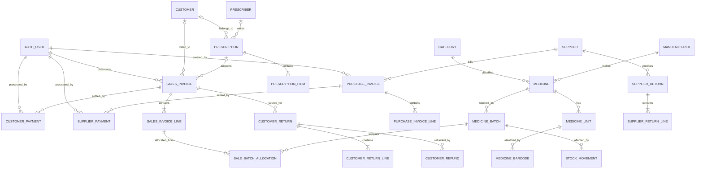

# Pharmacy Management System — Entity Relationship Design

**Status:** Approved Phase 1 schema baseline<br>
**Source:** `docs/BRD.md` Phase 1 minimum scope  
**Scope:** Baseline business models and migrations exist in the repository as of commit `5ce85db`; future schema changes must follow this approved baseline and use new migrations.

---

# 1. Design Principles

This ERD intentionally models only the minimum connected Phase 1 pharmacy workflow.

If this ERD conflicts with the approved Phase 1 BRD or the existing repository foundation, the BRD/repository wins and the ERD must be corrected before implementation.

## 1.1 Identifier strategy

All new project-owned business entities use UUID primary keys:

```python
id = models.UUIDField(
    primary_key=True,
    default=uuid.uuid4,
    editable=False,
)
```

Django-owned tables such as `auth_user`, `auth_group`, permissions, sessions, and admin tables keep their normal Django IDs.

The project must not replace Django's built-in User model merely to force UUIDs.

## 1.2 Numeric conventions

| Concept                  | Django representation                           |
| ------------------------ | ----------------------------------------------- |
| Quantity                 | `DecimalField(max_digits=14, decimal_places=3)` |
| Unit conversion          | `DecimalField(max_digits=14, decimal_places=6)` |
| Unit price / unit cost   | `DecimalField(max_digits=14, decimal_places=4)` |
| Posted totals / payments | `DecimalField(max_digits=14, decimal_places=2)` |
| Tax percentage           | `DecimalField(max_digits=7, decimal_places=4)`  |

Never use float for authoritative financial calculations.

### Unit economics and quantization

The base unit is the inventory unit. `MedicineUnit.conversion_to_base` expresses how many base units are contained in one selected unit.

```python
quantity_quantum = Decimal("0.001")
unit_value_quantum = Decimal("0.0001")

base_quantity = (selected_quantity * conversion_to_base).quantize(
    quantity_quantum,
    rounding=ROUND_HALF_UP,
)
selected_unit_price = (base_unit_price * conversion_to_base).quantize(
    unit_value_quantum,
    rounding=ROUND_HALF_UP,
)
acquisition_cost_per_base_unit = (
    selected_purchase_unit_cost / conversion_to_base
).quantize(unit_value_quantum, rounding=ROUND_HALF_UP)
```

`Medicine.default_selling_price` is the tax-exclusive base-unit price. `SalesInvoiceLine.unit_price` is the selected-unit price snapshot. `PurchaseInvoiceLine.unit_cost` is the tax-exclusive selected purchase-unit cost. `MedicineBatch.acquisition_cost_per_base_unit` is the converted four-decimal base-unit cost. Phase 1 discounts and tax affect invoice totals but not the acquisition-cost layer. Inventory quantities, allocations, and stock movements use the quantized three-decimal base quantity; the result must be greater than zero.

### Financial calculation and rounding policy

All authoritative calculations use `Decimal` and `ROUND_HALF_UP`. Prices and costs are tax-exclusive, and tax is calculated after the line discount:

```python
money_quantum = Decimal("0.01")
line_subtotal = (quantity * unit_price).quantize(
    money_quantum,
    rounding=ROUND_HALF_UP,
)
taxable_amount = line_subtotal - discount_amount
tax_amount = (
    taxable_amount * tax_rate_percent / Decimal("100")
).quantize(money_quantum, rounding=ROUND_HALF_UP)
line_total = (taxable_amount + tax_amount).quantize(
    money_quantum,
    rounding=ROUND_HALF_UP,
)
```

Purchase lines substitute `unit_cost` for `unit_price`. Quantity, conversion, and four-decimal unit price/cost values retain their approved precision until multiplication. Round the line subtotal to two decimals before applying the stored two-decimal discount, which must not exceed the subtotal. Round tax once to two decimals, then round the line total to two decimals.

Invoice totals sum the already-rounded line snapshots. Payments, refunds, paid totals, and balances use two decimals and the same rounding mode. Reports sum stored posted monetary snapshots. COGS uses full-precision `allocated_quantity_base × acquisition_cost_snapshot`, summed per sales line and then quantized to two decimals before aggregation.

## 1.3 Timestamp convention

Mutable entities normally include:

```python
created_at = models.DateTimeField(auto_now_add=True)
updated_at = models.DateTimeField(auto_now=True)
```

Append-style stock movements do not require `updated_at`.

Django stores aware timestamps in UTC because `USE_TZ = True`. For Phase 1, `TIME_ZONE = "UTC"` is also the explicit business timezone, and expiry eligibility uses `timezone.localdate()` under UTC. No separate timezone entity or inferred developer-machine timezone is permitted.

## 1.4 Deletion convention

- master/reference data uses `is_active`;
- master data with transaction history is deactivated rather than hard-deleted;
- draft transaction records may be deleted if unreferenced;
- posted/completed transaction records are retained;
- stock movements are append-style history and are not deleted through normal workflows.

## 1.5 `VOID` semantics

For `PurchaseInvoice`, `SalesInvoice`, `CustomerReturn`, and `SupplierReturn`, `VOID` is reserved for cancellation of an unposted/uncompleted `DRAFT`. A void draft has no stock movements, batch allocations, payments, refunds, or balance effect. Phase 1 services may allow only `DRAFT → VOID`; `POSTED → VOID` and `COMPLETED → VOID` are not valid Phase 1 transitions. Compensating reversal workflows for effective transactions remain deferred.

---

# 2. Django App Ownership

```text
apps/
├── accounts/
├── dashboard/
├── core/
├── catalog/
├── parties/
├── inventory/
├── purchasing/
├── sales/
├── prescriptions/
├── finance/
├── returns/
└── reports/
```

| App             | Owns                                                                                   |
| --------------- | -------------------------------------------------------------------------------------- |
| `accounts`      | Existing Django auth integration only                                                  |
| `dashboard`     | Dashboard views/widgets; no required business tables                                   |
| `core`          | Pharmacy settings, tax rates, payment methods                                          |
| `catalog`       | Category, Manufacturer, Medicine, MedicineUnit, MedicineBarcode                        |
| `parties`       | Supplier, Customer, Prescriber                                                         |
| `inventory`     | MedicineBatch, StockMovement, inventory services                                       |
| `purchasing`    | PurchaseInvoice, PurchaseInvoiceLine                                                   |
| `sales`         | SalesInvoice, SalesInvoiceLine, SaleBatchAllocation                                    |
| `prescriptions` | Prescription, PrescriptionItem                                                         |
| `finance`       | CustomerPayment, SupplierPayment                                                       |
| `returns`       | CustomerReturn, CustomerReturnLine, CustomerRefund, SupplierReturn, SupplierReturnLine |
| `reports`       | Query/report services only; no transaction tables                                      |

Stable navigation labels map to these namespaces/owning apps:

| Navigation label  | Namespace / owning app |
| ----------------- | ---------------------- |
| Dashboard         | `dashboard`            |
| Sales             | `sales`                |
| Medicines         | `catalog`              |
| Inventory         | `inventory`            |
| Suppliers         | `parties`              |
| Customers         | `parties`              |
| Prescriptions     | `prescriptions`        |
| Purchases         | `purchasing`           |
| Invoices          | `sales`                |
| Payments          | `finance`              |
| Returns & Refunds | `returns`              |
| Reports           | `reports`              |
| Settings          | `core`                 |

Navigation labels are not additional model-owning apps.

---

# 3. Relationship Overview



---

# 4. Existing Django Identity Entities

## 4.1 User

Use the existing Django built-in User.

Relevant behavior:

- username/password login;
- users may belong to Groups;
- permissions are inherited from Groups;
- business records reference users through `settings.AUTH_USER_MODEL`.

Do not create a replacement User model.

## 4.2 Groups

Exact business groups:

- `Owner / Admin`
- `Pharmacist`
- `Inventory Manager`
- `Accountant`

Django-generated model permissions plus selected custom business permissions are assigned to these Groups.

---

# 5. Core Entities (`apps.core`)

## 5.1 PharmacySettings

**Table:** `core_pharmacy_settings`

| Field                         | Type                 | Notes                      |
| ----------------------------- | -------------------- | -------------------------- |
| `id`                          | UUID PK              |                            |
| `singleton_key`               | PositiveSmallInteger | fixed `1`, unique          |
| `pharmacy_name`               | CharField(200)       | required                   |
| `phone`                       | CharField(32)        | blank                      |
| `email`                       | EmailField           | blank                      |
| `address`                     | TextField            | blank                      |
| `currency_code`               | CharField(3)         | single configured currency |
| `default_tax_rate`            | FK → TaxRate         | nullable                   |
| `expiry_warning_days`         | PositiveIntegerField | default e.g. 90            |
| `default_low_stock_threshold` | Decimal(14,3)        | default 0                  |
| `invoice_header`              | TextField            | blank                      |
| `invoice_footer`              | TextField            | blank                      |
| `receipt_footer`              | TextField            | blank                      |
| `created_at`                  | DateTimeField        |                            |
| `updated_at`                  | DateTimeField        |                            |

Constraints:

- exactly one row through `singleton_key = 1`;
- thresholds must be non-negative.

## 5.2 TaxRate

**Table:** `core_tax_rate`

| Field          | Type                  |
| -------------- | --------------------- |
| `id`           | UUID PK               |
| `code`         | CharField(30), unique |
| `name`         | CharField(100)        |
| `rate_percent` | Decimal(7,4)          |
| `is_active`    | Boolean               |
| `created_at`   | DateTime              |
| `updated_at`   | DateTime              |

Constraints:

- `0 <= rate_percent <= 100`.

Deletion:

- deactivate after use.

## 5.3 PaymentMethod

**Table:** `core_payment_method`

| Field                | Type                  |
| -------------------- | --------------------- |
| `id`                 | UUID PK               |
| `code`               | CharField(30), unique |
| `name`               | CharField(100)        |
| `requires_reference` | Boolean               |
| `is_active`          | Boolean               |
| `created_at`         | DateTime              |
| `updated_at`         | DateTime              |

Baseline codes:

- `CASH`
- `CARD`
- `BANK_TRANSFER`
- `OTHER`

---

# 6. Catalog Entities (`apps.catalog`)

## 6.1 Category

**Table:** `catalog_category`

Fields:

- `id UUID PK`
- `name CharField(120)`
- `is_active BooleanField(default=True)`
- `created_at`
- `updated_at`

Rules:

- name unique case-insensitively where practical;
- deactivate after transactional use.

## 6.2 Manufacturer

**Table:** `catalog_manufacturer`

Fields:

- `id UUID PK`
- `name CharField(160)`
- `is_active BooleanField(default=True)`
- `created_at`
- `updated_at`

## 6.3 Medicine

**Table:** `catalog_medicine`

| Field                      | Type                       |
| -------------------------- | -------------------------- |
| `id`                       | UUID PK                    |
| `name`                     | CharField(200)             |
| `generic_name`             | CharField(200), blank      |
| `category`                 | FK → Category, PROTECT     |
| `manufacturer`             | FK → Manufacturer, PROTECT |
| `strength`                 | CharField(100), blank      |
| `dosage_form`              | CharField(100), blank      |
| `prescription_required`    | Boolean                    |
| `low_stock_threshold_base` | Decimal(14,3), nullable    |
| `default_selling_price`    | Decimal(14,4), base-unit tax-exclusive price |
| `is_active`                | Boolean                    |
| `created_at`               | DateTime                   |
| `updated_at`               | DateTime                   |

Rules:

- price and threshold are non-negative;
- deactivate after transactional use.

## 6.4 MedicineUnit

**Table:** `catalog_medicine_unit`

| Field                | Type                   |
| -------------------- | ---------------------- |
| `id`                 | UUID PK                |
| `medicine`           | FK → Medicine, PROTECT |
| `name`               | CharField(80)          |
| `conversion_to_base` | Decimal(14,6)          |
| `is_base_unit`       | Boolean                |
| `purchase_allowed`   | Boolean                |
| `sale_allowed`       | Boolean                |
| `is_active`          | Boolean                |
| `created_at`         | DateTime               |
| `updated_at`         | DateTime               |

Constraints:

- unique `(medicine, name)`;
- exactly one active base unit per medicine;
- base conversion = `1`;
- conversion > `0`.

## 6.5 MedicineBarcode

**Table:** `catalog_medicine_barcode`

Fields:

- `id UUID PK`
- `medicine_unit FK → MedicineUnit, PROTECT`
- `barcode CharField(64), unique`
- `is_active Boolean`
- `created_at`
- `updated_at`

Barcode resolves to one medicine/unit combination.

---

# 7. Party Entities (`apps.parties`)

## 7.1 Supplier

**Table:** `parties_supplier`

Fields:

- `id UUID PK`
- `code CharField(40), unique`
- `name CharField(200)`
- `contact_person CharField(160), blank`
- `phone CharField(32), blank`
- `email EmailField, blank`
- `address TextField, blank`
- `notes TextField, blank`
- `is_active Boolean`
- `created_at`
- `updated_at`

## 7.2 Customer

**Table:** `parties_customer`

Fields:

- `id UUID PK`
- `code CharField(40), unique`
- `name CharField(200)`
- `phone CharField(32), blank`
- `email EmailField, blank`
- `address TextField, blank`
- `notes TextField, blank`
- `is_active Boolean`
- `created_at`
- `updated_at`

A walk-in sale uses `customer = NULL`; do not create a fake walk-in Customer row.

## 7.3 Prescriber

**Table:** `parties_prescriber`

Fields:

- `id UUID PK`
- `name CharField(200)`
- `phone CharField(32), blank`
- `professional_identifier CharField(80), blank`
- `notes TextField, blank`
- `is_active Boolean`
- `created_at`
- `updated_at`

---

# 8. Inventory Entities (`apps.inventory`)

## 8.1 MedicineBatch

**Table:** `inventory_medicine_batch`

| Field                            | Type                   |
| -------------------------------- | ---------------------- |
| `id`                             | UUID PK                |
| `medicine`                       | FK → Medicine, PROTECT |
| `batch_number`                   | CharField(100)         |
| `expiry_date`                    | DateField              |
| `acquisition_cost_per_base_unit` | Decimal(14,4)          |
| `quantity_available_base`        | Decimal(14,3)          |
| `first_received_at`              | DateTimeField          |
| `is_active`                      | Boolean                |
| `created_at`                     | DateTime               |
| `updated_at`                     | DateTime               |

Recommended Phase 1 cost-layer rule:

- a receipt with the same medicine, batch number, expiry date, **and acquisition cost** may reuse the same batch row;
- a different acquisition cost creates a separate batch/cost-layer row.

Recommended uniqueness:

```text
(medicine, batch_number, expiry_date, acquisition_cost_per_base_unit)
```

Rules:

- acquisition cost >= 0;
- normal operations keep quantity >= 0;
- expired batches are never eligible for sale.

## 8.2 StockMovement

**Table:** `inventory_stock_movement`

This is append-style stock history.

| Field                 | Type                        |
| --------------------- | --------------------------- |
| `id`                  | UUID PK                     |
| `medicine`            | FK → Medicine, PROTECT      |
| `batch`               | FK → MedicineBatch, PROTECT |
| `movement_type`       | CharField(32)               |
| `quantity_delta_base` | Decimal(14,3)               |
| `unit_cost_snapshot`  | Decimal(14,4), nullable     |
| `source_type`         | CharField(40)               |
| `source_id`           | UUIDField                   |
| `source_line_id`      | UUIDField, nullable         |
| `reference_number`    | CharField(80), blank        |
| `reason`              | TextField, blank            |
| `performed_by`        | FK → User, PROTECT          |
| `occurred_at`         | DateTimeField               |
| `created_at`          | DateTimeField               |

Movement types:

- `PURCHASE_RECEIPT`
- `SALE`
- `CUSTOMER_RETURN_RESTOCK`
- `SUPPLIER_RETURN`
- `MANUAL_ADJUSTMENT_IN`
- `MANUAL_ADJUSTMENT_OUT`

Phase 1 does not require stock counts/write-off workflow models. `MANUAL_ADJUSTMENT_IN` and `MANUAL_ADJUSTMENT_OUT` are reserved values already present in the repository schema; Phase 1 exposes no manual-adjustment UI, endpoint, or general stock-editing service, and those values must not be used to bypass an approved purchase, sale, or return workflow.

Authoritative source mapping:

| `movement_type` / `source_type` | `source_id`          | `source_line_id`         | `reference_number`               |
| ------------------------------- | -------------------- | ------------------------ | -------------------------------- |
| `PURCHASE_RECEIPT`              | `PurchaseInvoice.id` | `PurchaseInvoiceLine.id` | `PurchaseInvoice.invoice_number` |
| `SALE`                          | `SalesInvoice.id`    | `SaleBatchAllocation.id` | `SalesInvoice.invoice_number`    |
| `CUSTOMER_RETURN_RESTOCK`       | `CustomerReturn.id`  | `CustomerReturnLine.id`  | `CustomerReturn.return_number`   |
| `SUPPLIER_RETURN`               | `SupplierReturn.id`  | `SupplierReturnLine.id`  | `SupplierReturn.return_number`   |

For these four workflows, `source_type` equals the uppercase value in the first column. Exactly one stock movement is allowed for each non-null source line. Constraint `inventory_movement_source_line_unique` enforces uniqueness on `(movement_type, source_type, source_id, source_line_id)` where `source_line_id IS NOT NULL`; null `source_line_id` values remain available for reserved source-less/manual history. Service-level validation must also confirm that the movement medicine, batch, direction, quantity, and cost snapshot match the source line/allocation.

Rules:

- delta cannot be zero;
- receipt/restock deltas are positive;
- sale/supplier-return deltas are negative;
- rows are not edited/deleted through normal workflows;
- `MedicineBatch.quantity_available_base` changes only inside the inventory service in the same transaction that creates the movement.

---

# 9. Purchasing Entities (`apps.purchasing`)

## 9.1 PurchaseInvoice

**Table:** `purchasing_purchase_invoice`

| Field                        | Type                                |
| ---------------------------- | ----------------------------------- |
| `id`                         | UUID PK                             |
| `invoice_number`             | CharField(40), unique when posted   |
| `supplier_invoice_reference` | CharField(100), blank               |
| `supplier`                   | FK → Supplier, PROTECT              |
| `invoice_date`               | DateField                           |
| `due_date`                   | DateField, nullable                 |
| `status`                     | `DRAFT`, `POSTED`, `VOID`           |
| `payment_status`             | `UNPAID`, `PARTIAL`, `PAID`         |
| `supplier_name_snapshot`     | CharField(200), blank until posting |
| `pharmacy_name_snapshot`     | CharField(200), blank until posting |
| `currency_code`              | CharField(3)                        |
| `subtotal`                   | Decimal(14,2)                       |
| `discount_total`             | Decimal(14,2)                       |
| `tax_total`                  | Decimal(14,2)                       |
| `grand_total`                | Decimal(14,2)                       |
| `paid_total`                 | Decimal(14,2)                       |
| `remaining_balance`          | Decimal(14,2)                       |
| `created_by`                 | FK → User, PROTECT                  |
| `posted_by`                  | FK → User, nullable                 |
| `posted_at`                  | DateTime, nullable                  |
| `created_at`                 | DateTime                            |
| `updated_at`                 | DateTime                            |

Rules:

- `remaining_balance = grand_total - paid_total`;
- posted invoice requires at least one line;
- posted financial values are not silently rewritten;
- posting the purchase also performs stock receiving in Phase 1.

## 9.2 PurchaseInvoiceLine

**Table:** `purchasing_purchase_invoice_line`

| Field                           | Type                                       |
| ------------------------------- | ------------------------------------------ |
| `id`                            | UUID PK                                    |
| `purchase_invoice`              | FK → PurchaseInvoice, PROTECT              |
| `medicine`                      | FK → Medicine, PROTECT                     |
| `medicine_description_snapshot` | CharField(240)                             |
| `medicine_unit`                 | FK → MedicineUnit, PROTECT                 |
| `unit_name_snapshot`            | CharField(80)                              |
| `quantity`                      | Decimal(14,3)                              |
| `conversion_to_base_snapshot`   | Decimal(14,6)                              |
| `received_quantity_base`        | Decimal(14,3), quantized base quantity     |
| `unit_cost`                     | Decimal(14,4), selected-unit cost snapshot |
| `discount_amount`               | Decimal(14,2)                              |
| `tax_rate_percent`              | Decimal(7,4)                               |
| `tax_amount`                    | Decimal(14,2)                              |
| `line_total`                    | Decimal(14,2)                              |
| `batch_number`                  | CharField(100)                             |
| `expiry_date`                   | DateField                                  |
| `medicine_batch`                | FK → MedicineBatch, nullable until posting |
| `created_at`                    | DateTime                                   |
| `updated_at`                    | DateTime                                   |

Rules:

- quantity is the selected purchase-unit quantity and must be > 0;
- unit belongs to medicine and is purchase-allowed;
- `received_quantity_base` is `quantity × conversion_to_base_snapshot`, quantized to three decimals with `ROUND_HALF_UP`;
- the posting service derives `MedicineBatch.acquisition_cost_per_base_unit` as `unit_cost / conversion_to_base_snapshot`, quantized to four decimals with `ROUND_HALF_UP`;
- cost/discount/tax >= 0;
- expiry date must be valid at posting;
- posted line identifies its resulting batch/cost layer.

---

# 10. Prescription Entities (`apps.prescriptions`)

## 10.1 Prescription

**Table:** `prescriptions_prescription`

Fields:

- `id UUID PK`
- `reference_number CharField(80), blank`
- `customer FK → Customer, SET_NULL, nullable`
- `prescriber FK → Prescriber, SET_NULL, nullable`
- `prescription_date DateField`
- `notes TextField, blank`
- `attachment FileField, optional`
- `created_by FK → User, PROTECT`
- `created_at`
- `updated_at`

Phase 1 keeps prescription lifecycle simple; no complex status state machine is required.

## 10.2 PrescriptionItem

**Table:** `prescriptions_prescription_item`

Fields:

- `id UUID PK`
- `prescription FK → Prescription, CASCADE`
- `medicine FK → Medicine, PROTECT`
- `quantity_prescribed Decimal(14,3), nullable`
- `dosage_instructions TextField, blank`
- `notes TextField, blank`
- `created_at`
- `updated_at`

---

# 11. Sales Entities (`apps.sales`)

## 11.1 SalesInvoice

One entity represents the sale while being prepared and after completion.

**Table:** `sales_sales_invoice`

| Field                     | Type                                   |
| ------------------------- | -------------------------------------- |
| `id`                      | UUID PK                                |
| `invoice_number`          | CharField(40), unique when completed   |
| `status`                  | `DRAFT`, `COMPLETED`, `VOID`           |
| `customer`                | FK → Customer, nullable for walk-in    |
| `prescription`            | FK → Prescription, nullable            |
| `pharmacist`              | FK → User, PROTECT                     |
| `pharmacy_name_snapshot`  | CharField(200), blank until completion |
| `customer_name_snapshot`  | CharField(200), blank                  |
| `customer_phone_snapshot` | CharField(32), blank                   |
| `currency_code`           | CharField(3)                           |
| `subtotal`                | Decimal(14,2)                          |
| `discount_total`          | Decimal(14,2)                          |
| `tax_total`               | Decimal(14,2)                          |
| `grand_total`             | Decimal(14,2)                          |
| `paid_total`              | Decimal(14,2)                          |
| `balance_due`             | Decimal(14,2)                          |
| `payment_status`          | `UNPAID`, `PARTIAL`, `PAID`            |
| `completed_at`            | DateTime, nullable                     |
| `created_at`              | DateTime                               |
| `updated_at`              | DateTime                               |

Rules:

- walk-in completed sale must have `balance_due = 0`;
- completed sale requires at least one line;
- completed line/invoice snapshots are retained.

## 11.2 SalesInvoiceLine

**Table:** `sales_sales_invoice_line`

| Field                               | Type                       |
| ----------------------------------- | -------------------------- |
| `id`                                | UUID PK                    |
| `sales_invoice`                     | FK → SalesInvoice, PROTECT |
| `medicine`                          | FK → Medicine, PROTECT     |
| `medicine_description_snapshot`     | CharField(240)             |
| `medicine_unit`                     | FK → MedicineUnit, PROTECT |
| `unit_name_snapshot`                | CharField(80)              |
| `quantity`                          | Decimal(14,3)              |
| `conversion_to_base_snapshot`       | Decimal(14,6)              |
| `requested_quantity_base`           | Decimal(14,3), quantized base quantity |
| `unit_price`                        | Decimal(14,4), selected-unit price snapshot |
| `discount_amount`                   | Decimal(14,2)              |
| `tax_rate_percent`                  | Decimal(7,4)               |
| `tax_amount`                        | Decimal(14,2)              |
| `line_total`                        | Decimal(14,2)              |
| `prescription_required_snapshot`    | Boolean                    |
| `prescription_warning_acknowledged` | Boolean                    |
| `created_at`                        | DateTime                   |
| `updated_at`                        | DateTime                   |

Rules:

- quantity is the selected sale-unit quantity and must be > 0;
- unit belongs to medicine and is sale-allowed;
- requested base quantity is `quantity × conversion_to_base_snapshot`, quantized to three decimals with `ROUND_HALF_UP`;
- unit price is `Medicine.default_selling_price × conversion_to_base_snapshot`, quantized to four decimals with `ROUND_HALF_UP` when the sale snapshot is created;
- if prescription-required, warning acknowledgment is required before completion.

## 11.3 SaleBatchAllocation

**Table:** `sales_sale_batch_allocation`

This explicitly records FEFO allocation for a completed sales line.

| Field                       | Type                           |
| --------------------------- | ------------------------------ |
| `id`                        | UUID PK                        |
| `sales_invoice_line`        | FK → SalesInvoiceLine, PROTECT |
| `batch`                     | FK → MedicineBatch, PROTECT    |
| `allocated_quantity_base`   | Decimal(14,3)                  |
| `acquisition_cost_snapshot` | Decimal(14,4)                  |
| `created_at`                | DateTime                       |

Rules:

- allocation > 0;
- batch belongs to the line medicine;
- batch is non-expired at completion;
- total allocations for the line equal requested base quantity;
- `(sales_invoice_line, batch)` is unique through `sales_allocation_line_batch_unique`; the allocation service aggregates a line's quantity for the same batch instead of creating duplicates;
- allocations are created by the sales/inventory service during completion.

COGS for a line is derived from:

```text
sum(allocated_quantity_base × acquisition_cost_snapshot)
```

The corresponding negative `StockMovement` rows are created for each allocation.

The mapping is explicit through the existing generic source-reference fields; no reverse foreign key from inventory to sales is added. For every allocation created during sale completion, exactly one corresponding movement must have:

```text
movement_type = "SALE"
source_type = "SALE"
source_id = SalesInvoice.id
source_line_id = SaleBatchAllocation.id
medicine = SalesInvoiceLine.medicine
batch = SaleBatchAllocation.batch
quantity_delta_base = -SaleBatchAllocation.allocated_quantity_base
unit_cost_snapshot = SaleBatchAllocation.acquisition_cost_snapshot
reference_number = SalesInvoice.invoice_number
```

The allocation, negative movement, and batch quantity decrease are created atomically by the sales/inventory service. This one-to-one mapping and exact quantity correspondence are service-layer invariants because the schema intentionally uses generic UUID source references rather than a circular hard foreign key.

---

# 12. Finance Entities (`apps.finance`)

## 12.1 CustomerPayment

**Table:** `finance_customer_payment`

| Field             | Type                        |
| ----------------- | --------------------------- |
| `id`              | UUID PK                     |
| `sales_invoice`   | FK → SalesInvoice, PROTECT  |
| `customer`        | FK → Customer, nullable     |
| `payment_method`  | FK → PaymentMethod, PROTECT |
| `amount`          | Decimal(14,2)               |
| `reference`       | CharField(150), blank       |
| `processed_by`    | FK → User, PROTECT          |
| `paid_at`         | DateTime                    |
| `status`          | `POSTED`, `REVERSED`        |
| `reversed_by`     | FK → User, nullable         |
| `reversed_at`     | DateTime, nullable          |
| `reversal_reason` | TextField, blank            |
| `created_at`      | DateTime                    |

Rules:

- amount > 0;
- active payments cannot exceed current invoice balance;
- reversal preserves the original payment row;
- invoice paid/balance/status is recalculated after posting/reversal.

## 12.2 SupplierPayment

**Table:** `finance_supplier_payment`

| Field              | Exact Django type and behavior                                                                          |
| ------------------ | ------------------------------------------------------------------------------------------------------- |
| `id`               | `UUIDField(primary_key=True, default=uuid.uuid4, editable=False)`                                       |
| `purchase_invoice` | `ForeignKey(PurchaseInvoice, on_delete=PROTECT, related_name="payments")`                               |
| `supplier`         | `ForeignKey(Supplier, on_delete=PROTECT, related_name="payments")`                                      |
| `payment_method`   | `ForeignKey(PaymentMethod, on_delete=PROTECT, related_name="supplier_payments")`                        |
| `amount`           | `DecimalField(max_digits=14, decimal_places=2)`                                                         |
| `reference`        | `CharField(max_length=150, blank=True)`                                                                 |
| `processed_by`     | `ForeignKey(User, on_delete=PROTECT, related_name="supplier_payments_processed")`                       |
| `paid_at`          | `DateTimeField()`                                                                                       |
| `status`           | `CharField(max_length=10, choices=POSTED/REVERSED, default=POSTED)`                                     |
| `reversed_by`      | `ForeignKey(User, on_delete=PROTECT, null=True, blank=True, related_name="supplier_payments_reversed")` |
| `reversed_at`      | `DateTimeField(null=True, blank=True)`                                                                  |
| `reversal_reason`  | `TextField(blank=True)`; stored as an empty string when omitted, not `NULL`                             |
| `created_at`       | `DateTimeField(auto_now_add=True)`                                                                      |

No explicit model default is declared for `reversed_by`, `reversed_at`, or `reversal_reason`. The nullable fields resolve to `NULL` when omitted; `reversal_reason` is non-null and resolves to an empty string when omitted. A finance service changes `POSTED → REVERSED`, sets `reversed_by` and `reversed_at`, may record `reversal_reason`, preserves the original row, and recalculates the purchase invoice balance. Complex reversal state machines are not part of Phase 1.

---

# 13. Return Entities (`apps.returns`)

## 13.1 CustomerReturn

**Table:** `returns_customer_return`

Fields:

- `id UUID PK`
- `return_number CharField(40), unique`
- `sales_invoice FK → SalesInvoice, PROTECT`
- `customer FK → Customer, nullable`
- `reason TextField`
- `return_total Decimal(14,2)`
- `status DRAFT/POSTED/VOID`
- `processed_by FK → User`
- `posted_at DateTime, nullable`
- `created_at`
- `updated_at`

## 13.2 CustomerReturnLine

**Table:** `returns_customer_return_line`

Fields:

- `id UUID PK`
- `customer_return FK → CustomerReturn, PROTECT`
- `sales_invoice_line FK → SalesInvoiceLine, PROTECT`
- `batch FK → MedicineBatch, PROTECT`
- `returned_quantity_base Decimal(14,3)`
- `condition RESELLABLE/NON_RESELLABLE`
- `restock Boolean`
- `refund_amount Decimal(14,2)`
- `created_at`
- `updated_at`

Rules:

- return quantity > 0;
- `sales_invoice_line` belongs to `customer_return.sales_invoice`;
- `batch` identifies the one `SaleBatchAllocation` for `(sales_invoice_line, batch)`, whose uniqueness is required in section 11.3;
- cumulative returned quantity for that sales-line/batch pair cannot exceed the allocated quantity;
- `restock=True` requires a non-expired resellable item and restores the original batch through inventory service.

The line-and-batch structure matches the implemented repository model while remaining unambiguous because of the required allocation uniqueness constraint. A separate duplicate allocation foreign key is not added.

## 13.3 CustomerRefund

**Table:** `returns_customer_refund`

Fields:

- `id UUID PK`
- `refund_number CharField(40), unique`
- `customer_return FK → CustomerReturn, PROTECT`
- `sales_invoice FK → SalesInvoice, PROTECT`
- `payment_method FK → PaymentMethod, PROTECT`
- `amount Decimal(14,2)`
- `reference CharField(150), blank`
- `processed_by FK → User`
- `refunded_at DateTime`
- `status POSTED`
- `created_at`

For Phase 1, a refund is a separate linked transaction and does not rewrite the original sale total.

Statements/reporting account for the refund separately.

Refund reversal is not supported in Phase 1. `CustomerRefund` is posted-only because no reversal actor, timestamp, reason, or compensating financial workflow is approved. The `REVERSED` choice is therefore intentionally absent.

## 13.4 SupplierReturn

**Table:** `returns_supplier_return`

Fields:

- `id UUID PK`
- `return_number CharField(40), unique`
- `supplier FK → Supplier, PROTECT`
- `purchase_invoice FK → PurchaseInvoice, nullable`
- `reason TextField`
- `return_total Decimal(14,2)`
- `status DRAFT/POSTED/VOID`
- `processed_by FK → User`
- `posted_at DateTime, nullable`
- `created_at`
- `updated_at`

## 13.5 SupplierReturnLine

**Table:** `returns_supplier_return_line`

Fields:

- `id UUID PK`
- `supplier_return FK → SupplierReturn, PROTECT`
- `medicine FK → Medicine, PROTECT`
- `batch FK → MedicineBatch, PROTECT`
- `returned_quantity_base Decimal(14,3)`
- `unit_cost_snapshot Decimal(14,4)`
- `line_total Decimal(14,2)`
- `created_at`
- `updated_at`

Posting decreases the exact batch through inventory service and creates a negative `StockMovement`.

---

# 14. Reports and Balances

No report transaction tables are required.

Invoice balances are historical payment-only values. For sales, `paid_total` sums active posted customer payments and `balance_due = grand_total - paid_total`. For purchases, `paid_total` sums active posted supplier payments and `remaining_balance = grand_total - paid_total`. Later returns, refunds, and supplier returns do not rewrite invoice totals, paid totals, payment status, or balance fields.

Party statements derive a separate net position from invoices, active payments, returns, and refunds. From the pharmacy's perspective, positive means the party owes the pharmacy and negative means the pharmacy owes the party: sales invoices are positive; customer payments and posted return credits are negative; customer refund payouts are positive settlements of return credits; purchase invoices are negative; supplier payments and posted supplier returns are positive. Each event is applied once, with no mutable balance table or general ledger.

Derived queries/services calculate:

- current inventory;
- low stock;
- near expiry;
- expired stock;
- sales;
- purchases;
- receivables;
- payables;
- customer statements;
- supplier statements;
- COGS;
- basic gross profit.

Do not introduce mutable `customer_balance`, `supplier_balance`, or report summary tables as sources of truth.

---

# 15. Permission Design

Django automatically creates model permissions:

```text
<app_label>.add_<model>
<app_label>.view_<model>
<app_label>.change_<model>
<app_label>.delete_<model>
```

Examples:

```text
catalog.view_medicine
catalog.add_medicine
parties.change_supplier
inventory.view_medicinebatch
```

Special business actions should use explicit custom permissions where CRUD permission is insufficient.

Recommended Phase 1 custom permissions:

```text
purchasing.post_purchaseinvoice
sales.complete_sale
finance.post_customerpayment
finance.post_supplierpayment
finance.view_financial_reports
returns.post_customerreturn
returns.post_supplierreturn
returns.process_refund
```

`finance.view_financial_reports` is declared on `CustomerPayment`, so Django creates it under the existing finance content type without a fake reports model. Owner/Admin and Accountant receive this permission. Pharmacist and Inventory Manager use their owning-app permissions for operational and inventory/purchasing reports; they do not receive the financial-report permission.

Protected views/actions must enforce permissions server-side.

---

# 16. Inventory Service Boundary

`apps.inventory` exclusively owns:

- creating/updating received batch cost layers;
- increasing stock;
- decreasing stock;
- FEFO eligible-batch queries;
- safe customer-return restocking;
- supplier-return deduction;
- stock movement creation.

Manual-adjustment movement codes are reserved only; there is no Phase 1 manual-adjustment operation.

Other apps must not do this directly:

```python
batch.quantity_available_base -= quantity
```

They must call inventory services.

Every stock mutation and corresponding `StockMovement` must occur in the same `transaction.atomic()` block.

Minimum Phase 1 concurrency rules:

- purchase posting locks the `PurchaseInvoice` and any existing `MedicineBatch` cost layer it will increase;
- sale completion locks the `SalesInvoice` and eligible `MedicineBatch` rows in deterministic FEFO order (`expiry_date`, `first_received_at`, `id`) before revalidating availability;
- customer/supplier return posting locks the return and affected batches before checking or changing quantities;
- customer/supplier payment posting or reversal locks the affected sales/purchase invoice before checking or recalculating its balance.

Use `select_for_update()` inside `transaction.atomic()` and re-check status, quantities, and balances after acquiring the locks. A generic locking framework is not required.

---

# 17. Simplified Transaction Relationships

## Purchase

```text
Supplier
  ↓
PurchaseInvoice
  ↓
PurchaseInvoiceLine
  ↓
MedicineBatch
  ↓
StockMovement (+)
```

## Sale

```text
Customer? / Walk-in
  ↓
SalesInvoice
  ↓
SalesInvoiceLine
  ↓
SaleBatchAllocation
  ↓
MedicineBatch
  ↓
StockMovement (-)
```

## Customer payment

```text
SalesInvoice
  ↓
CustomerPayment(s)
  ↓
paid_total / balance_due / payment_status
```

## Supplier payment

```text
PurchaseInvoice
  ↓
SupplierPayment(s)
  ↓
paid_total / remaining_balance / payment_status
```

## Customer return

```text
SalesInvoice
  ↓
CustomerReturn
  ↓
CustomerReturnLine
  ├── safe + restock → StockMovement (+)
  └── non-resellable → no stock increase
  ↓
CustomerRefund
```

## Supplier return

```text
PurchaseInvoice?
  ↓
SupplierReturn
  ↓
SupplierReturnLine
  ↓
StockMovement (-)
```

---

# 18. Explicitly Removed from Phase 1 ERD

The following models/structures from the previous ERD are intentionally removed from the minimum Phase 1 schema:

- `PurchaseOrder`
- `PurchaseOrderItem`
- `PurchaseReceipt`
- `PurchaseReceiptLine`
- `StockOperation`
- `StockCount`
- `StockCountLine`
- `StockAdjustment`
- `StockAdjustmentLine`
- `StockDiscrepancy`
- `InventoryAlert`
- `IdempotencyRecord`
- `AuditEvent`
- `CashierShift`
- `ShiftCashMovement`
- `DocumentSequence`

They may be designed later as Phase 2 features after explicit team approval.

---

# 19. Phase 1 Decisions That Remove Previous Open Questions

To keep the schema implementable within the delivery window:

1. **Batch cost layers:** same medicine + batch number + expiry + cost may reuse a batch row; a different cost creates another cost-layer row.
2. **Timezone:** UTC is the explicit Phase 1 business timezone because the repository uses `TIME_ZONE = "UTC"` and `USE_TZ = True`; FEFO uses `timezone.localdate()` under UTC.
3. **Document numbering:** no `DocumentSequence` is required. Generate identifiers deterministically from the complete uppercase UUID hex value: `SAL-{uuid_hex}`, `PUR-{uuid_hex}`, `CRT-{uuid_hex}`, `SRT-{uuid_hex}`, and `CRF-{uuid_hex}`. Draft sales/purchase numbers may remain blank until completion/posting; return/refund numbers are assigned at creation. Database uniqueness remains mandatory.
4. **Discounts:** prices/costs are tax-exclusive. Owner/Admin and Pharmacist may set sales-line discounts; Owner/Admin and Inventory Manager may set purchase-line discounts. Store the authoritative amount, constrained from zero through the rounded line subtotal. Percentage UI may calculate the amount before server validation; Phase 1 has no approval tiers.
5. **Tax:** tax is server-calculated after discount using Decimal arithmetic and the financial rounding policy in section 1.2.
6. **Prescription association:** one optional prescription per sale is sufficient for Phase 1.
7. **Purchase invoice receiving:** the purchase invoice itself is the receiving document; no PO/receipt consolidation question exists.
8. **Customer return condition:** Pharmacist or Owner/Admin may classify the item in the permitted return workflow.
9. **Refunds/returns:** represented as separate linked transactions; do not rewrite original invoice totals.
10. **Customer credit:** no credit limit/approval system; saved customers may carry partial/unpaid balances.
11. **Currency:** one configured currency only.
12. **Idempotency:** generic idempotency infrastructure is deferred.

---

# 20. Implementation Guardrails

1. This ERD is approved and baseline Phase 1 models/migrations now exist. Any schema change must be coordinated, reviewed against this document, and represented by a new migration; do not rewrite applied migration history.
2. Preserve existing Django User/Group/session/login/logout behavior.
3. Use UUID/Decimal conventions consistently.
4. Each business entity has exactly one owning app.
5. Reports/dashboard must not create duplicate source-of-truth models.
6. Inventory quantity may only be changed through `apps.inventory`.
7. Purchase posting, sale completion, payments, and returns must use `transaction.atomic()` plus the targeted row locks defined in section 16.
8. Posted records preserve snapshots and traceability.
9. Do not reintroduce removed Phase 2 entities during implementation without explicit approval.
10. Sale-line/batch allocations and non-null authoritative stock-movement source lines must retain their documented uniqueness constraints; never weaken them in posting services or later migrations.
