# Pharmacy Management System - Readable ERD Diagrams

**Status:** Visual companion to the approved Phase 1 schema baseline  
**Authoritative source:** [`docs/ERD.md`](ERD.md)  
**Scope:** Relationships and cardinalities only; exact fields, constraints, indexes, precision, and deletion policies remain defined by the authoritative ERD.

## Why this is split into several diagrams

A single diagram for every Phase 1 entity creates crossing connectors and makes repeated entities such as `Medicine`, `MedicineBatch`, `SalesInvoice`, and `User` difficult to trace. These views intentionally repeat shared anchor entities so each relationship stays local and readable. A repeated box represents the same table, not a duplicate table.

## Reading the connectors

| Symbol | Meaning |
| --- | --- |
| `||` | exactly one |
| `o|` | zero or one |
| `|{` | one or many |
| `o{` | zero or many |
| solid relationship | database foreign key or Django-owned many-to-many relation |
| dashed relationship | logical traceability through `source_type`, `source_id`, and `source_line_id`; not a database foreign key |

Every relationship label names the foreign-key field or the business role of that field.

For invoice, prescription, and return line collections, `|{` describes the approved posted/completed business invariant. A draft parent record may temporarily have no lines before it is posted or completed.

---

# 1. End-to-End Business Flow

This is the navigation view. It shows transaction flow, not database cardinality.

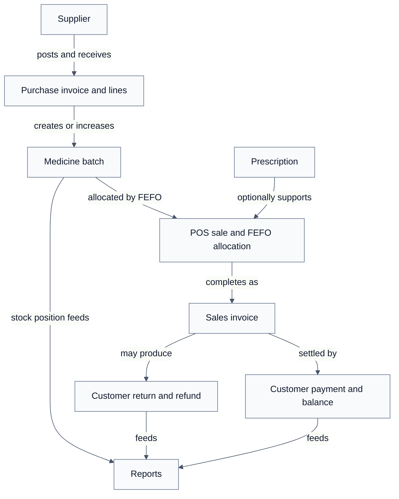

---

# 2. Authentication and Core Settings

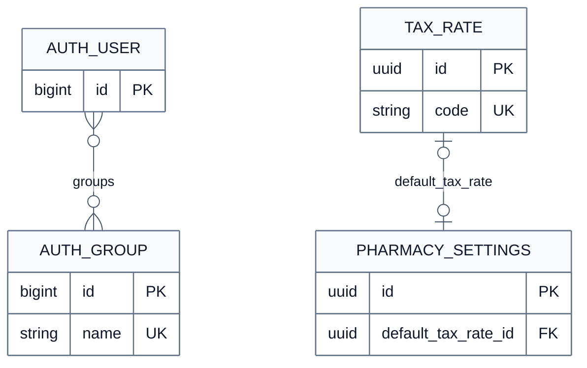

`PaymentMethod` is shown in the payment/refund views where its actual foreign keys are used. `User` is repeated in transaction views to make actor relationships explicit.

---

# 3. Medicine Catalog

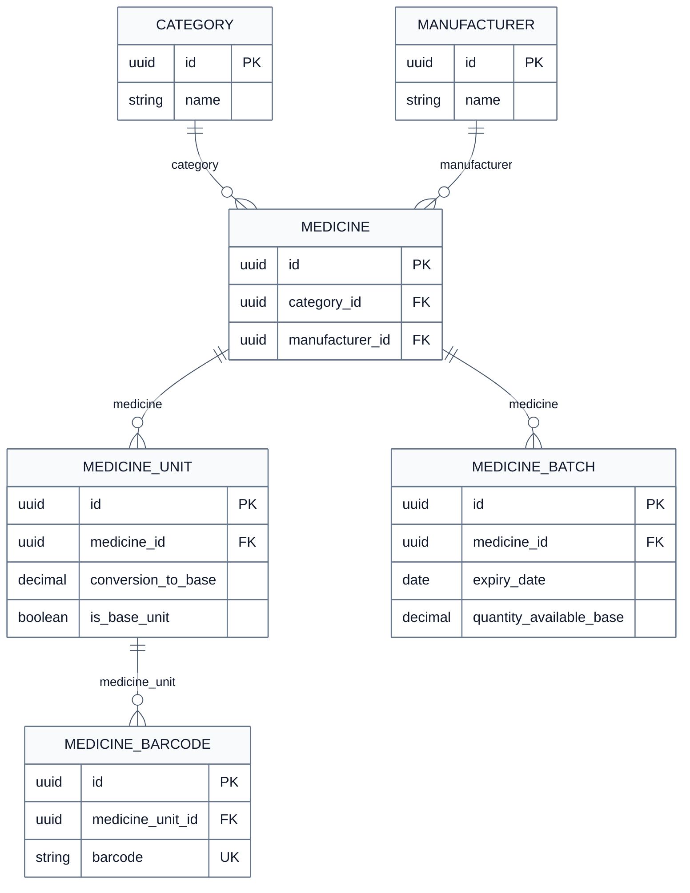

---

# 4. Purchasing and Batch Receipt

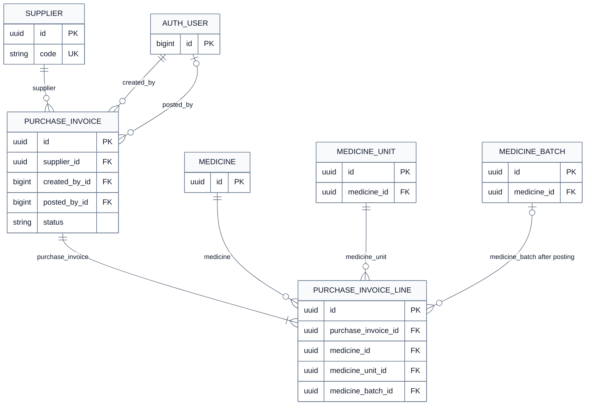

Posting a purchase line resolves its optional `medicine_batch` and creates one positive purchase-receipt stock movement. The movement link is shown separately in section 13 because it is logical source traceability rather than a foreign key.

---

# 5. Prescription Record

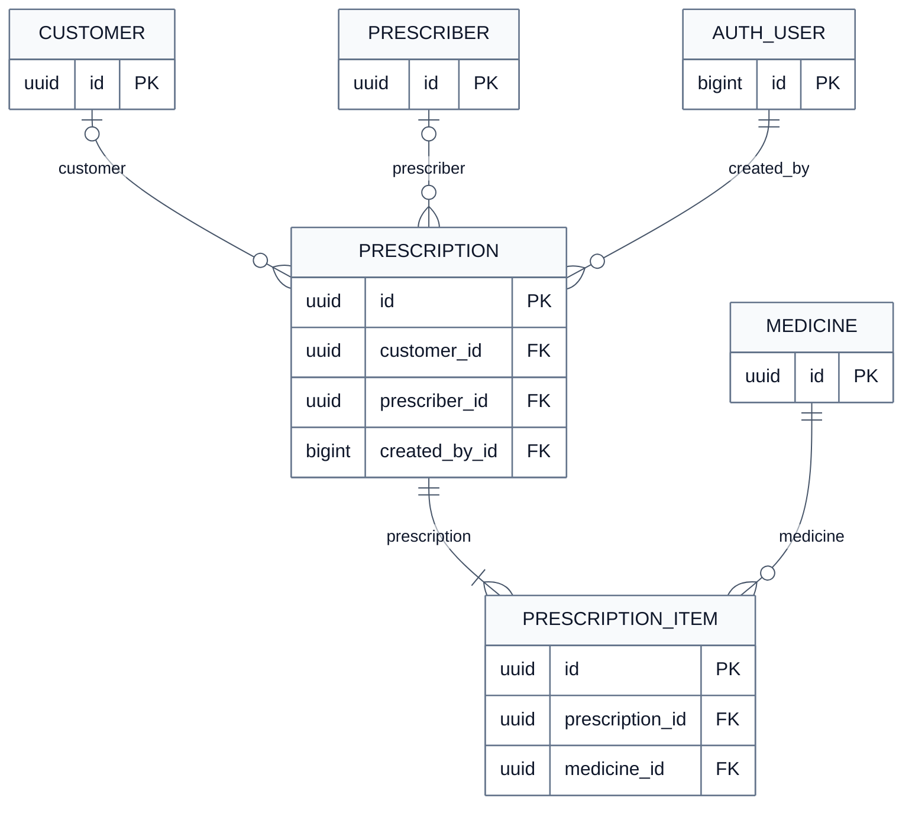

---

# 6. Sales Header and Lines

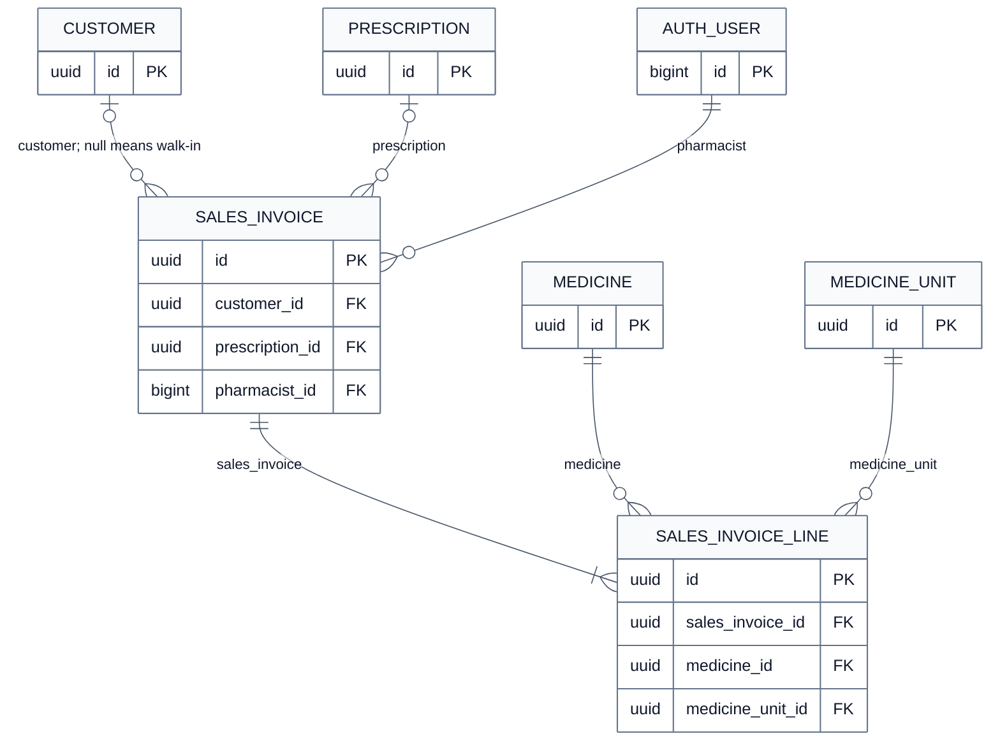

---

# 7. FEFO Batch Allocation

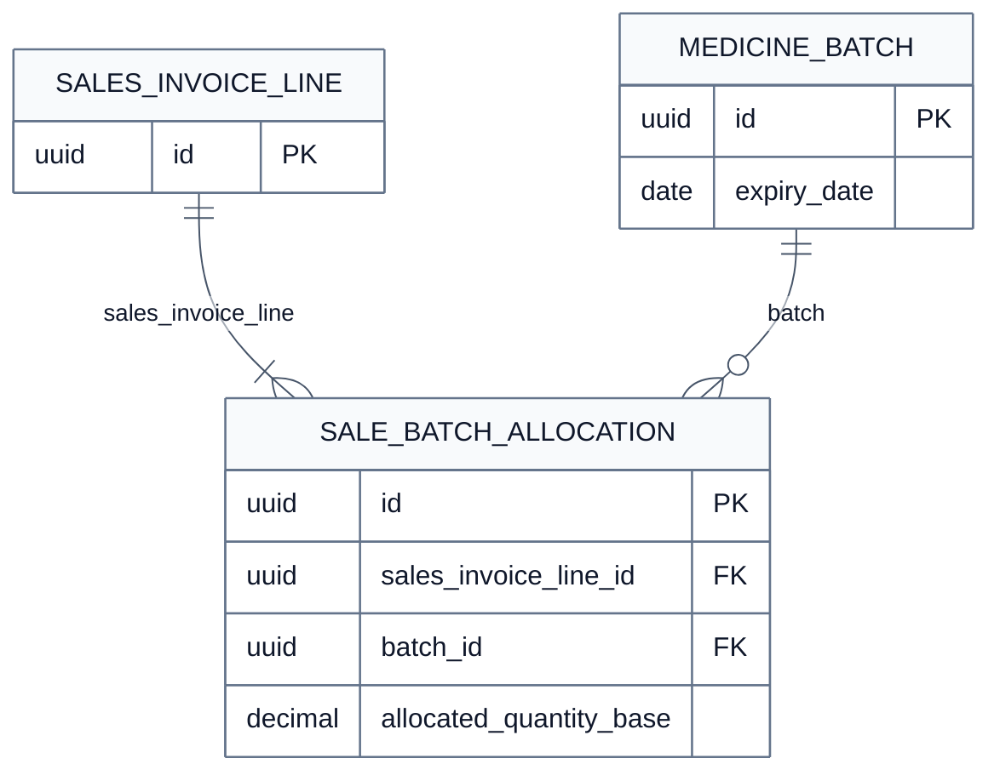

One completed sales line may allocate across several batches. The `(sales_invoice_line, batch)` pair is unique, so the same batch cannot appear twice for one line.

---

# 8. Customer Payment and Invoice Balance

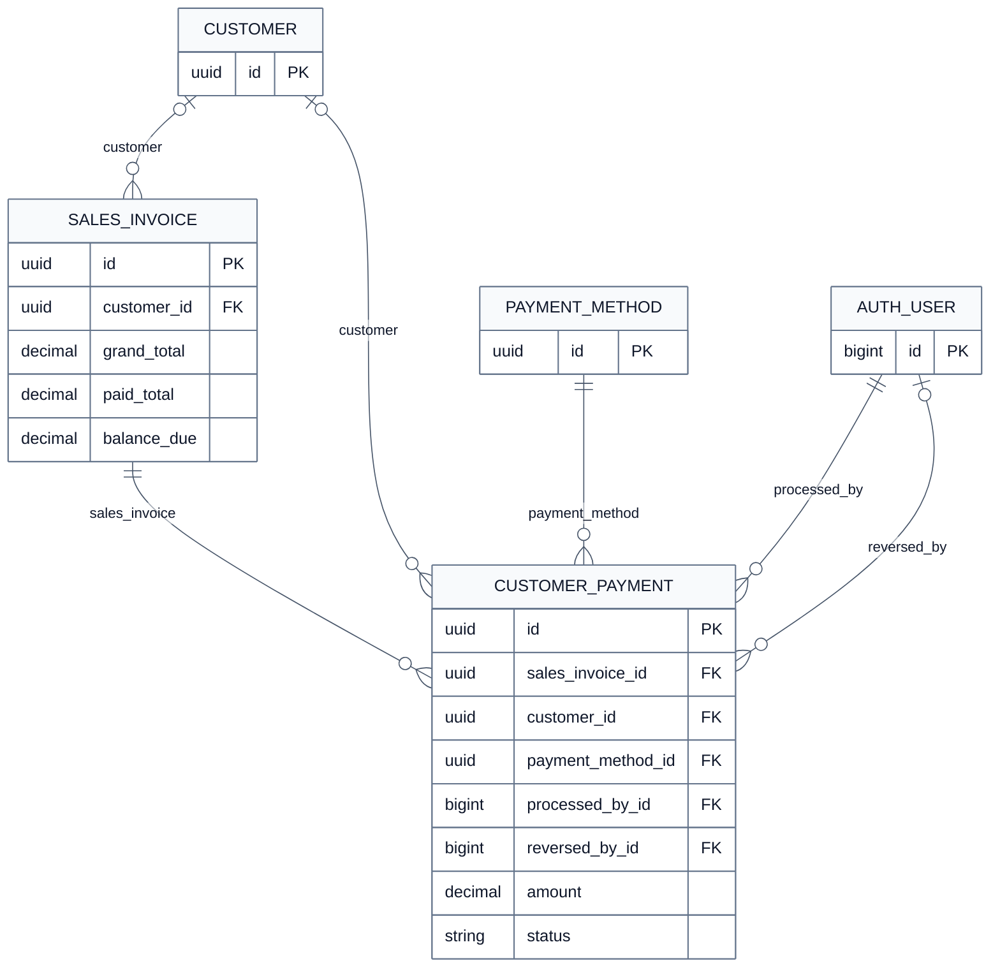

The invoice balance is derived from posted, non-reversed customer payments. Payments remain separate transaction rows; they do not replace or rewrite the invoice.

---

# 9. Customer Return and Lines

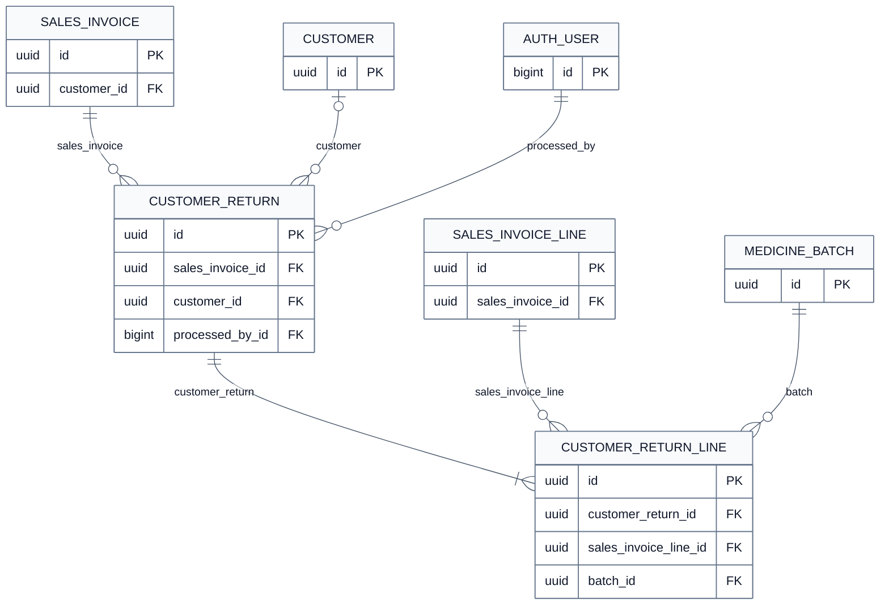

The return line identifies the original sales line and exact allocated batch. A resellable restock creates a positive stock movement.

---

# 10. Customer Refund

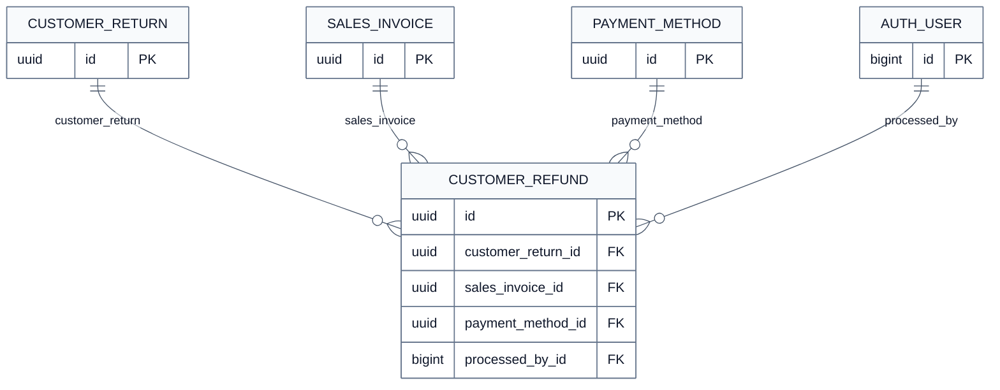

The refund is a separate posted financial transaction. It does not rewrite the original sale total.

---

# 11. Supplier Payment and Invoice Balance

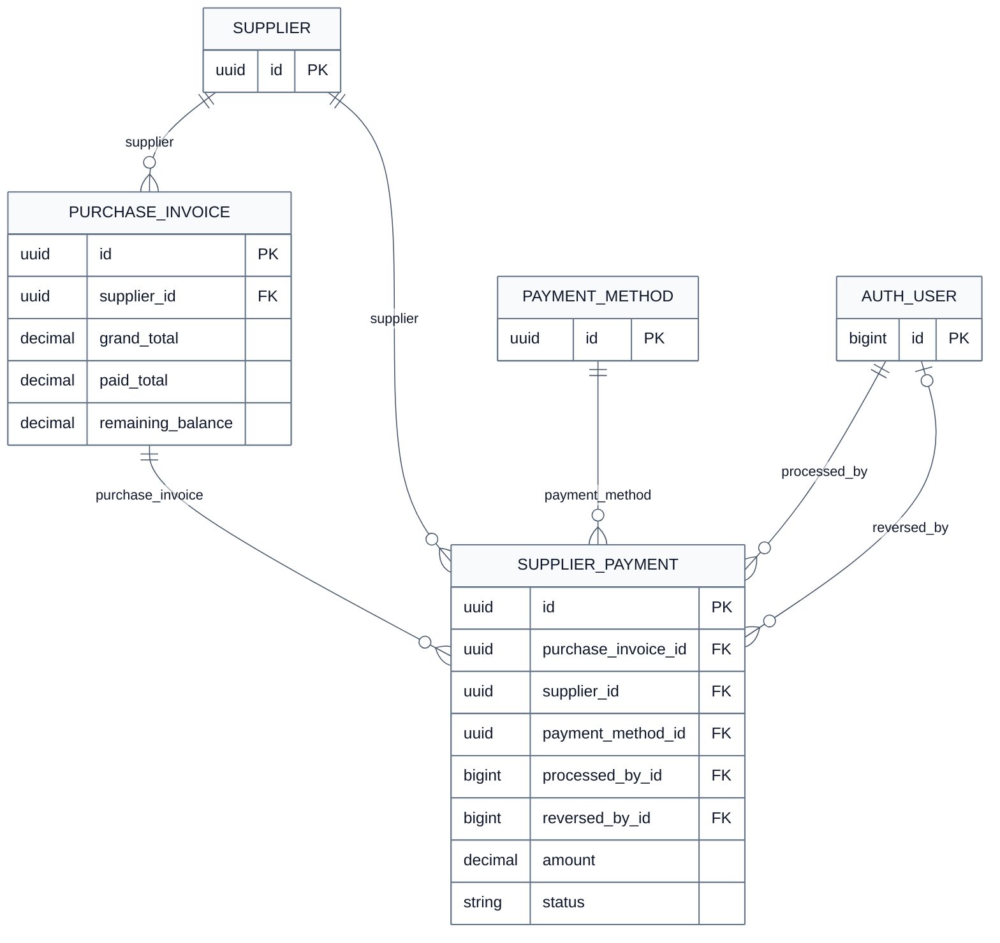

The purchase-invoice balance is derived from posted, non-reversed supplier payments. Supplier returns affect the supplier statement separately and are shown in section 12.

---

# 12. Supplier Return

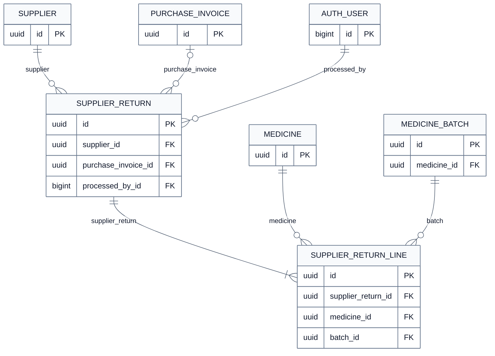

Posting decreases the exact selected batch and creates one negative supplier-return stock movement for each return line.

---

# 13. Authoritative Stock Movement and Source Traceability

This view deliberately distinguishes real foreign keys from the generic source reference. There is no database foreign key from a source line/allocation to `StockMovement`.

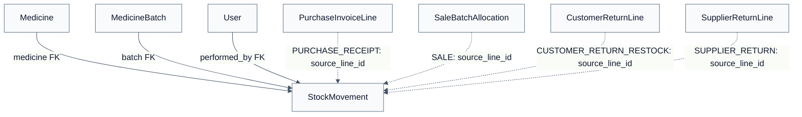

The logical source mapping is:

| Movement/source type | `source_id` identifies | `source_line_id` identifies | Direction |
| --- | --- | --- | --- |
| `PURCHASE_RECEIPT` | `PurchaseInvoice` | `PurchaseInvoiceLine` | positive |
| `SALE` | `SalesInvoice` | `SaleBatchAllocation` | negative |
| `CUSTOMER_RETURN_RESTOCK` | `CustomerReturn` | `CustomerReturnLine` | positive |
| `SUPPLIER_RETURN` | `SupplierReturn` | `SupplierReturnLine` | negative |

`apps.inventory` is the only app allowed to change `MedicineBatch.quantity_available_base`. The batch change and its stock movement are created in the same database transaction.

---

# 14. Complete Foreign-Key Relationship Index

This index is the text fallback for every connector. “Optional” means the foreign-key column may be `NULL`.

| Owning entity | Foreign-key field | Referenced entity | Optional |
| --- | --- | --- | --- |
| `PharmacySettings` | `default_tax_rate` | `TaxRate` | Yes |
| `Medicine` | `category` | `Category` | No |
| `Medicine` | `manufacturer` | `Manufacturer` | No |
| `MedicineUnit` | `medicine` | `Medicine` | No |
| `MedicineBarcode` | `medicine_unit` | `MedicineUnit` | No |
| `MedicineBatch` | `medicine` | `Medicine` | No |
| `StockMovement` | `medicine` | `Medicine` | No |
| `StockMovement` | `batch` | `MedicineBatch` | No |
| `StockMovement` | `performed_by` | `User` | No |
| `PurchaseInvoice` | `supplier` | `Supplier` | No |
| `PurchaseInvoice` | `created_by` | `User` | No |
| `PurchaseInvoice` | `posted_by` | `User` | Yes |
| `PurchaseInvoiceLine` | `purchase_invoice` | `PurchaseInvoice` | No |
| `PurchaseInvoiceLine` | `medicine` | `Medicine` | No |
| `PurchaseInvoiceLine` | `medicine_unit` | `MedicineUnit` | No |
| `PurchaseInvoiceLine` | `medicine_batch` | `MedicineBatch` | Yes, until posting |
| `Prescription` | `customer` | `Customer` | Yes |
| `Prescription` | `prescriber` | `Prescriber` | Yes |
| `Prescription` | `created_by` | `User` | No |
| `PrescriptionItem` | `prescription` | `Prescription` | No |
| `PrescriptionItem` | `medicine` | `Medicine` | No |
| `SalesInvoice` | `customer` | `Customer` | Yes; null is walk-in |
| `SalesInvoice` | `prescription` | `Prescription` | Yes |
| `SalesInvoice` | `pharmacist` | `User` | No |
| `SalesInvoiceLine` | `sales_invoice` | `SalesInvoice` | No |
| `SalesInvoiceLine` | `medicine` | `Medicine` | No |
| `SalesInvoiceLine` | `medicine_unit` | `MedicineUnit` | No |
| `SaleBatchAllocation` | `sales_invoice_line` | `SalesInvoiceLine` | No |
| `SaleBatchAllocation` | `batch` | `MedicineBatch` | No |
| `CustomerPayment` | `sales_invoice` | `SalesInvoice` | No |
| `CustomerPayment` | `customer` | `Customer` | Yes |
| `CustomerPayment` | `payment_method` | `PaymentMethod` | No |
| `CustomerPayment` | `processed_by` | `User` | No |
| `CustomerPayment` | `reversed_by` | `User` | Yes |
| `SupplierPayment` | `purchase_invoice` | `PurchaseInvoice` | No |
| `SupplierPayment` | `supplier` | `Supplier` | No |
| `SupplierPayment` | `payment_method` | `PaymentMethod` | No |
| `SupplierPayment` | `processed_by` | `User` | No |
| `SupplierPayment` | `reversed_by` | `User` | Yes |
| `CustomerReturn` | `sales_invoice` | `SalesInvoice` | No |
| `CustomerReturn` | `customer` | `Customer` | Yes |
| `CustomerReturn` | `processed_by` | `User` | No |
| `CustomerReturnLine` | `customer_return` | `CustomerReturn` | No |
| `CustomerReturnLine` | `sales_invoice_line` | `SalesInvoiceLine` | No |
| `CustomerReturnLine` | `batch` | `MedicineBatch` | No |
| `CustomerRefund` | `customer_return` | `CustomerReturn` | No |
| `CustomerRefund` | `sales_invoice` | `SalesInvoice` | No |
| `CustomerRefund` | `payment_method` | `PaymentMethod` | No |
| `CustomerRefund` | `processed_by` | `User` | No |
| `SupplierReturn` | `supplier` | `Supplier` | No |
| `SupplierReturn` | `purchase_invoice` | `PurchaseInvoice` | Yes |
| `SupplierReturn` | `processed_by` | `User` | No |
| `SupplierReturnLine` | `supplier_return` | `SupplierReturn` | No |
| `SupplierReturnLine` | `medicine` | `Medicine` | No |
| `SupplierReturnLine` | `batch` | `MedicineBatch` | No |

The Django-managed `User`-to-`Group` membership is many-to-many and remains part of Django's built-in authentication schema.
